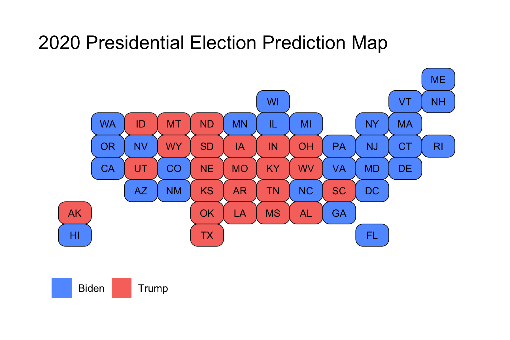
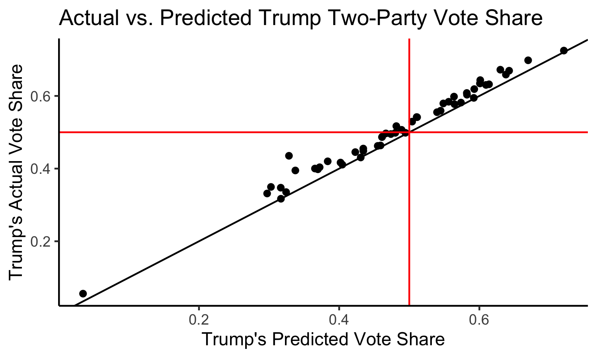
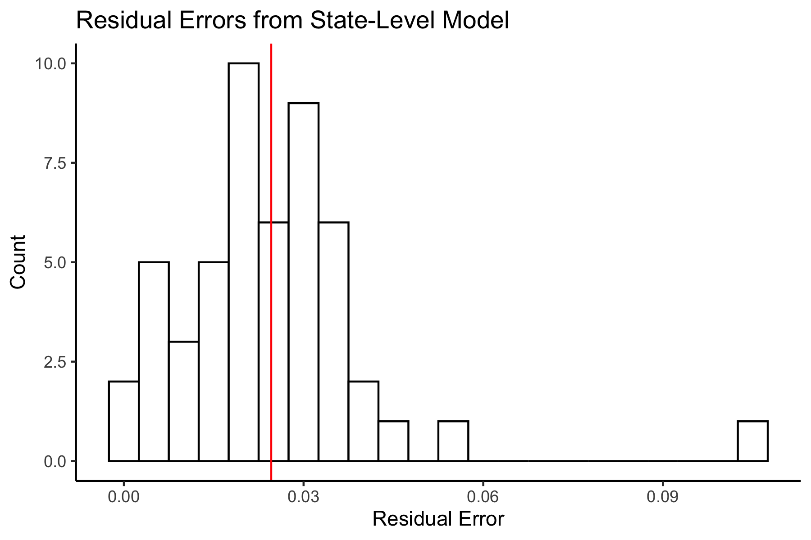
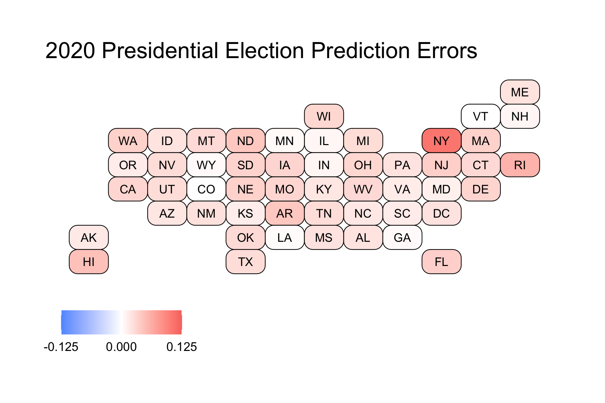

# Post-Election Reflection

## November 23, 2020

<br>

### Recap of My Model:

***Biden was predicted to win both the National Popular Vote and the Electoral College.***

#### National Prediction

This model predicted Republican Two-Party Vote Share from just two variables: the last Republican Two-Party Vote Share (from the last Presidential Election) and the Republican Weighted Poll Average. 

With coefficients, this was the national-level regression:

```
Rep. Two-Party PV = 0.072 + 0.122 * Last Rep. Two-Party PV + 0.736 * Rep. Weighted Poll Avg.
```

My final estimate was that Trump would receive a Two-Party Vote Share of 0.464 with a 95% Confidence Interval of (0.445 - 0.482), and Biden would receive a Two-Party Vote Share of 0.536 with a 95% Confidence Interval of (0.518 - 0.555). 

The distribution of outcomes from 10,000 simulations are shown below:


This model predicted that it was near-impossible for Trump to win the National Popular Vote.

#### State-Level Predictions

This model predicted Republican Two-Party Vote Share from the last Republican Two-Party Vote Share, the Republican Weighted Poll Average, Republican Incumbent, and White Percent of Population.

With coefficients, this was the state-level regression: 

```
Rep. Two-Party PV = -0.063 + 0.157 * Last Rep. Two-Party PV + 0.929 * Rep. Weighted Poll Avg. - 0.003 * Rep. Incumbent + 0.030 * White Percent of Population
```

This produced the following Electoral College Map Prediction:



However, some of these races were predicted to be extremely close, so I instead decided to color in the map by breaking down certainty. Those breaks were Solid (predicted to win by >10%), Lean (predicted to win by >5%), and Toss-Up (within 5%). This break-down produced the following map:


We can see that the model narrowly predicted that Biden wins in some key battleground states, like Georgia, Arizona, North Carolina, and Florida, whereas Trump was predicted to narrowly win in other battleground states like Texas, Ohio, and Iowa. Notably, this model predicted that the Midwestern States that Trump had won in 2016 would flip back to Biden, and that he would win by more than 5%. Because these states had pushed Biden over 270 electoral votes, I had not actually shared the first map in my final prediction, as I wanted people to know that the 7 battelground states that I colored in gold were predicted to be extremely close races, while still showing that Biden was predicted to win. However, I am including it here for the purposes of showing the actual predicted winner in those states so that I can compare model accuracy to the actual election results.

For a final Electoral Vote Prediction, the model predicted that Trump would receive 188 Electoral Votes with a 95% Confidence Interval of (150 - 204) and Biden would receive 350 Electoral Votes with a 95% Confidence Interval of (334 - 388). This essentially predicts a landslide victory for Biden. However, due to the extremely close races in the key battleground states, I felt that these confidence intervals were still a bit smaller than I'd expect. As a result, what I did instead was calculate the out-of-sample margin of error from the 25% testing split I'd used, and then use that margin of error to calculate a wider confidence interval. These 95% Confidence Intervals were (114 - 325) Electoral Votes for Trump and (213 - 424) for Biden. This means that with the revised confidence intervals, Trump was still predicted to lose, but it was indeed within the range of uncertainty for him to win the Electoral College.

### Model Accuracy

The actual election results were that Trump received a Two-Party Vote Share of 0.4803 and Biden received a Two-Party Vote Share of 0.5197. In the Electoral College, Trump won 232 Votes to Biden's 306 Votes.

***The National Popular Vote model underpredicted Trump by about 1.6%.*** 

This metric puts the Popular Vote estimate slightly above that of The Economist (2.4% off) and FiveThirtyEight (1.9% off). However, this is not truly the prediction we care about, since the winner of American elections is not determined by the Popular Vote, but instead by the Electoral Vote.

***From a classification standpoint, the state-level predictions were actually pretty good.***

The model was able to accurately predict the winner in 49 out of the 51 races (50 States and DC), for a classification accuracy of just above 96%. Some highlights were that the model was able to accurately predict the races in the Midwest (even though this model predicted a bigger Biden win in these states, he was still able to claim victory), and in the newer battleground states of Georgia and Arizona.

The two races that were incorrectly predicted were Florida and North Carolina. Both of these states were predicted to go for Biden, but instead voted for Trump. These two states account for 44 electoral votes, because they are larger states, which is why the Electoral Vote Prediction was pretty far off (188 Predicted for Trump vs. 232 Actual for Trump).

***From a point-estimate standpoint, the state-level predictions were not great.***

Trump's Actual Two-Party Vote Share vs. Trump's Predicted Two-Party Vote Share:



Here we have a solid black line indicating the boundary where the model perfectly predicted the actual result. We also have solid red lines at 0.5, which allow us to break the graph into four quadrants: in the top right, we have states that the model correctly predicted a Trump win, in the bottom left we have states that the model correctly predicted a Trump loss, in the top left we have states that the model incorrectly predicted a Trump loss, and in the bottom right we would have states that the model incorrectly predicted a Trump win (although none such states exist). 

We can see that most states lie above the line, indicating that the model underpredicted Trump's performance across the board.

Calculating the residuals (actual - predicted values) for each state then allows us to calculate the Root Mean Squared Error, which is found to be 0.02987, meaning that on average, our state predictions were off by about 2.987%. This is not great, but also not totally awful. This metric puts my model on par with FiveThirtyEight, whose forecast had an RMSE of 3.02%, and slightly worse than The Economist, whose forecast had an RMSE of 2.80%. In addition, all three of our forecasts missed only Florida and North Carolina. This makes sense, because my model, like theirs, gives a lot of weight to polling. As I will discuss later, this may not have been the best route to have taken.

Plotting a histogram of the state-level residuals yields the following plot:



We can see that these are concentrated above 0, again indicating that almost all of the states (except for Colorado -- which was just barely negative) had underpredicted Trump's performance. We can see the mean error is 0.02460, meaning that on average, the state-level predictions had underpredicted Trump by 2.46%. Let's now take a look at where the predictions were the worst.



The more red a state is, the more the model underpredicted Trump. Colorado, as previously mentioned, was the sole state that was overpredicted. Still, as shown by how white Colorado is in the map, it was only overpredicted by a very small amount. Because of the vast red across the map, we can see that the model underpredicted Trump across the board. 

We can look at states that were predicted the best (those that have errors under 1%): 

* Vermont: 0.0000941
* Colorado: -0.000126
* Louisiana: 0.00258
* Georgia: 0.00404
* Wyoming: 0.00427
* Minnesota: 0.00467
* Illinois: 0.00635
* New Hampshire: 0.00751
* Indiana: 0.00792

These are a diverse group of states. We have some solid Blue States (like Vermont, Colorado, and Illinois), some solid Red States (like Louisiana, Wyoming, and Indiana), and some battleground states (Georgia, and New Hampshire). These are also from regions across the country, indicating that there is not a common trend which would tell us why these states were predicted correctly.

We can also look at states that were predicted the worst:

* New York: 0.107 (Votes are not totally reported in NY when this data was scraped, so this is expected)
* Rhode Island: 0.0574
* Hawaii: 0.0469
* Arkansas: 0.0423
* North Dakota: 0.0423
* New Jersey: 0.0364
* Florida: 0.0354
* Washington: 0.0348
* Nebraska: 0.0343
* Massachusetts: 0.0343

Except for perhaps Florida, these states are all solid Blue or Red States. This makes sense because our model was based on polling, and for most solid states, there are few polls actually conducted (because their outcome is likely to remain the same as it always is, and pollsters do not want to waste money). 

### Proposed Hypotheses

### Proposed Quantitative Tests

### How Would I Change My Model?


