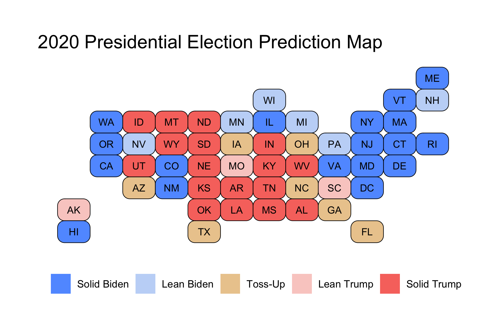
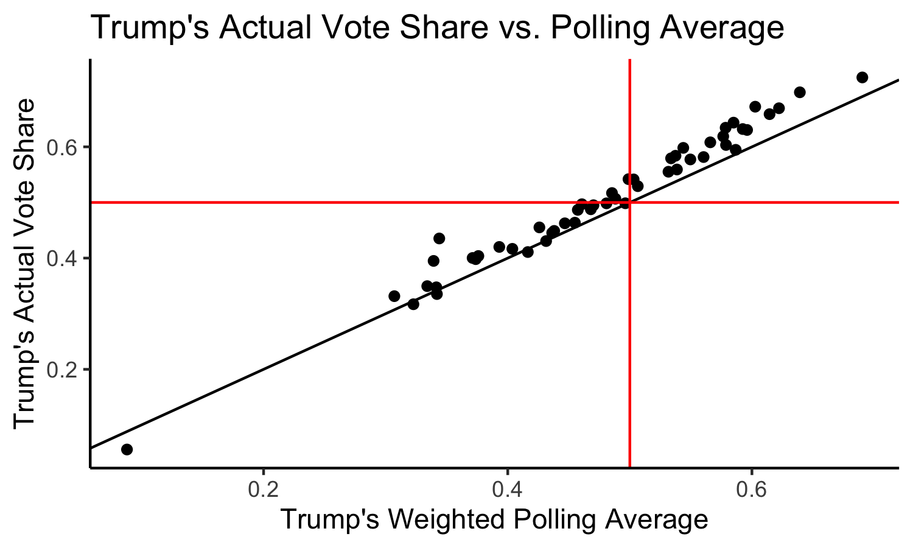
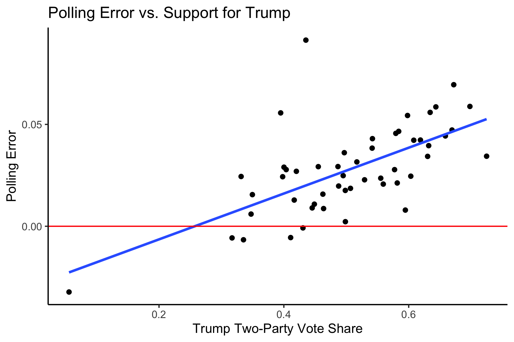

# Post-Election Reflection

## November 23, 2020

<br>

### Recap of My Model:

***Biden was predicted to win both the National Popular Vote and the Electoral College.***

#### National Prediction

This model predicted Republican Two-Party Vote Share from just two variables: the last Republican Two-Party Vote Share (from the last Presidential Election) and the Republican Weighted Poll Average. 

With coefficients, this was the national-level regression:

```
Rep. Two-Party PV = 0.072 + 0.122 * Last Rep. Two-Party PV + 0.736 * Rep. Weighted Poll Avg.
```

My final estimate was that Trump would receive a Two-Party Vote Share of 0.464 with a 95% Confidence Interval of (0.445 - 0.482), and Biden would receive a Two-Party Vote Share of 0.536 with a 95% Confidence Interval of (0.518 - 0.555). 

The distribution of outcomes from 10,000 simulations are shown below:


This model predicted that it was near-impossible for Trump to win the National Popular Vote.

#### State-Level Predictions

This model predicted Republican Two-Party Vote Share from the last Republican Two-Party Vote Share, the Republican Weighted Poll Average, Republican Incumbent, and White Percent of Population.

With coefficients, this was the state-level regression: 

```
Rep. Two-Party PV = -0.063 + 0.157 * Last Rep. Two-Party PV + 0.929 * Rep. Weighted Poll Avg. - 0.003 * Rep. Incumbent + 0.030 * White Percent of Population
```

This produced the following Electoral College Map Prediction:


However, some of these races were predicted to be extremely close, so I instead decided to color in the map by breaking down certainty. Those breaks were Solid (predicted to win by >10%), Lean (predicted to win by >5%), and Toss-Up (within 5%). This break-down produced the following map:



We can see that the model narrowly predicted that Biden wins in some key battleground states, like Georgia, Arizona, North Carolina, and Florida, whereas Trump was predicted to narrowly win in other battleground states like Texas, Ohio, and Iowa. Notably, this model predicted that the Midwestern States that Trump had won in 2016 would flip back to Biden, and that he would win by more than 5%. Because these states had pushed Biden over 270 electoral votes, I had not actually shared the first map in my final prediction, as I wanted people to know that the 7 battelground states that I colored in gold were predicted to be extremely close races, while still showing that Biden was predicted to win. However, I am including it here for the purposes of showing the actual predicted winner in those states so that I can compare model accuracy to the actual election results.

For a final Electoral Vote Prediction, the model predicted that Trump would receive 188 Electoral Votes with a 95% Confidence Interval of (150 - 204) and Biden would receive 350 Electoral Votes with a 95% Confidence Interval of (334 - 388). This essentially predicts a landslide victory for Biden. However, due to the extremely close races in the key battleground states, I felt that these confidence intervals were still a bit smaller than I'd expect. As a result, what I did instead was calculate the out-of-sample margin of error from the 25% testing split I'd used, and then use that margin of error to calculate a wider confidence interval. These 95% Confidence Intervals were (114 - 325) Electoral Votes for Trump and (213 - 424) for Biden. This means that with the revised confidence intervals, Trump was still predicted to lose, but it was indeed within the range of uncertainty for him to win the Electoral College.

### Model Accuracy

The actual election results were that Trump received a Two-Party Vote Share of 0.4803 and Biden received a Two-Party Vote Share of 0.5197. In the Electoral College, Trump won 232 Votes to Biden's 306 Votes.

***The National Popular Vote model underpredicted Trump by about 1.6%.*** 

This metric puts the Popular Vote estimate slightly above that of The Economist (2.4% off) and FiveThirtyEight (1.9% off). However, this is not truly the prediction we care about, since the winner of American elections is not determined by the Popular Vote, but instead by the Electoral Vote.

***From a classification standpoint, the state-level predictions were actually pretty good.***

The model was able to accurately predict the winner in 49 out of the 51 races (50 States and DC), for a classification accuracy of just above 96%. Some highlights were that the model was able to accurately predict the races in the Midwest (even though this model predicted a bigger Biden win in these states, he was still able to claim victory), and in the newer battleground states of Georgia and Arizona.

The two races that were incorrectly predicted were Florida and North Carolina. Both of these states were predicted to go for Biden, but instead voted for Trump. These two states account for 44 electoral votes, because they are larger states, which is why the Electoral Vote Prediction was pretty far off (188 Predicted for Trump vs. 232 Actual for Trump).

***From a point-estimate standpoint, the state-level predictions were not great.***

Trump's Actual Two-Party Vote Share vs. Trump's Predicted Two-Party Vote Share:


Here we have a solid black line indicating the boundary where the model perfectly predicted the actual result. We also have solid red lines at 0.5, which allow us to break the graph into four quadrants: in the top right, we have states that the model correctly predicted a Trump win, in the bottom left we have states that the model correctly predicted a Trump loss, in the top left we have states that the model incorrectly predicted a Trump loss, and in the bottom right we would have states that the model incorrectly predicted a Trump win (although none such states exist). 

We can see that most states lie above the line, indicating that the model underpredicted Trump's performance across the board.

Calculating the residuals (actual - predicted values) for each state then allows us to calculate the Root Mean Squared Error, which is found to be 0.02987, meaning that on average, our state predictions were off by about 2.987%. This is not great, but also not totally awful. This metric puts my model on par with FiveThirtyEight, whose forecast had an RMSE of 3.02%, and slightly worse than The Economist, whose forecast had an RMSE of 2.80%. In addition, all three of our forecasts missed only Florida and North Carolina. This makes sense, because my model, like theirs, gives a lot of weight to polling. As I will discuss later, this may not have been the best route to have taken.

Plotting a histogram of the state-level residuals yields the following plot:


We can see that these are concentrated above 0, again indicating that almost all of the states (except for Colorado -- which was just barely negative) had underpredicted Trump's performance. We can see the mean error is 0.02460, meaning that on average, the state-level predictions had underpredicted Trump by 2.46%. Let's now take a look at where the predictions were the worst.


The more red a state is, the more the model underpredicted Trump. Colorado, as previously mentioned, was the sole state that was overpredicted. Still, as shown by how white Colorado is in the map, it was only overpredicted by a very small amount. Because of the vast red across the map, we can see that the model underpredicted Trump across the board. 

We can look at states that were predicted the best (those that have errors under 1%): 

* Vermont: 0.0000941
* Colorado: -0.000126
* Louisiana: 0.00258
* Georgia: 0.00404
* Wyoming: 0.00427
* Minnesota: 0.00467
* Illinois: 0.00635
* New Hampshire: 0.00751
* Indiana: 0.00792

These are a diverse group of states. We have some solid Blue States (like Vermont, Colorado, and Illinois), some solid Red States (like Louisiana, Wyoming, and Indiana), and some battleground states (Georgia, and New Hampshire). These are also from regions across the country, indicating that there is not a common trend which would tell us why these states were predicted correctly.

We can also look at states that were predicted the worst:

* New York: 0.107 
* Rhode Island: 0.0574
* Hawaii: 0.0469
* Arkansas: 0.0423
* North Dakota: 0.0423
* New Jersey: 0.0364
* Florida: 0.0354
* Washington: 0.0348
* Nebraska: 0.0343
* Massachusetts: 0.0343

Except for perhaps Florida, these states are all solid Blue or Red States. This makes sense because our model was based on polling, and for most solid states, there are few polls actually conducted (because their outcome is likely to remain the same as it always is, and pollsters do not want to waste money). Votes were not fully reported in NY when this data was scraped, so this is expected.

### Proposed Hypotheses

First and foremost, the state-level model only uses four different variables: 

* the former election results
* the weighted poll averages
* incumbency
* white percent of population

Of these four variables, we can see that the weighted polling average contributes the most to the prediction by the coefficients on the variables. Because of this, I want to see if there is a relationship between the model residuals and the poll errors (calculated as the difference between Trump's Actual Two-Party Vote Share and the Weighted Polling Average). So we can look at the following plot below:


The solid black line indicates a perfect 1 to 1 relationship. The red line is a regression line between the two variables. I also decided to color the points by Trump's Actual Two-Party Vote Share, so that I could better determine relationships. We can see that by the shading of the points, states that voted more heavily for Trump (lighter points) tend to lie below the solid black line, indicating that the polling errors were worse than the model residuals for those states. This means that our other variables helped to improve our prediction in more Red States. However, we can also see that darker states tend to lie above that line, indicating that the polling errors were actually better than the model residuals in those states, meaning that the other variables in the model made our prediction worse than the polls would have predicted on their own. The regression line indicates that there is a moderately strong, positive, correlation between the Poll Errors and the Model Residuals (R^2 = 0.479). The worse the polling average, the worse the prediction would be. The better the polling average, the better the prediction would be. This makes sense because polls contributed so much to the final prediction.

So what went wrong? Well, we know that the polls weren't great this year, in fact, they may even be worse than they were in 2016. Why were the polls so wrong again? We can think of a few different hypotheses, which I will dive into below. First, we can look at a graph of the actual results (Trump's Two-Party Vote Share) vs. the polling averages.



Again, the solid black line indicates a perfect 1 to 1 relationship. We can see that most of the points lie above the solid black line, meaning that the polls underpredicted Trump's performance across the board, which explains why our model underpredicted Trump's performance across the board (after all, Iowa was the only state which the model predicted differently than the polls indicated). The mean poll error was 0.02785, meaning that on average, the weighted poll average was 2.785% less than what Trump actually received.

Specifically, the worst polling errors were in the following states:

* New York: 0.0914
* North Dakota: 0.0695
* West Virginia: 0.0588
* Arkansas: 0.0586
* South Dakota: 0.0559
* Rhode Island: 0.0556
* Nebraska: 0.0544
* Oklahoma: 0.0472
* Montana: 0.0466
* Missouri: 0.0456

We can see that these states are for the most part solid Red States (except for New York, which has not reported all of its votes at the time of this data collection, and Rhode Island). This may lead us to make our first hypothesis: if a state is a solid Red State, then the polls are going to be worse estimates of the vote *because there are less polls conducted in solid states*.

We can quasi-test this hypothesis by looking at states where there are more polls: battleground states. If this hypothesis were correct, we would expect the poll errors to be smaller than average in these states.

In our key battleground states, the polling errors were:

* Iowa: 0.0430
* Ohio: 0.383
* Wisconsin: 0.0361
* Florida: 0.0316
* Michigan: 0.0293
* Pennsylvania: 0.0249
* Texas: 0.0228
* North Carolina: 0.0186
* Arizona: 0.0176
* Georgia: 0.00225

These are for the most part, mixed results. The first five states listed have above-average polling errors, indicating that these were more wrong than most other states. However, the last five listed have below-average polling errors, indicating that these were more right than most other states. This means our first hypothesis may not be completely correct. Perhaps there isn't a relationship between how "solid" a state is and the polling error. We can look at one more graph to "test" this hypothesis, one which shows the relationship between Trump's Two-Party Vote Share (i.e. how "Red" a state is) and the polling error:



The red solid line indicates the boundary for where the poll error = 0, meaning points above the line indicates that the polls underpredicted Trump and points below the line indicates that the polls overpredict Trump. The blue line is a regression line, indicating a moderately strong, positive association between support for Trump and the polling error (R^2 = 0.401). It is interesting to note that the polls are similarly as bad in solid Blue States, meaning that we should fine tune our hypothesis more, because we would expect solid Blue States to have just as few polls as solid Red States, but the polls there are much better.

My refined hypothesis: If states are solid Red States, the polls are going to be worse because there is a base of Trump voters who are anti-government, anti-institutions, and anti-media, and thus going to be less likely to respond to polls. These voters are likely to be in rural areas, which are much more concentrated in Red States (which also have an advantage in the Electoral College as these rural, low-population areas are intentionally protected by the Founders and given slight boosts through the additional 2 votes per state on top of the proportional electoral votes).

This is different from the "Shy Trump Theory," which has been explained by [Politico](https://www.politico.com/news/magazine/2020/10/29/2020-polls-trump-biden-prediction-accurate-2016-433619) as the idea that voters who like Trump are reluctant to share their views to pollsters and others because they believe it is not socially acceptable to like Trump. Thus, they may tell Pollsters one thing, but instead vote another. I don't believe this to be true. Trump supporters tend to be unapologetically pro-Trump. Instead, I agree with the [Washington Post](https://www.washingtonpost.com/opinions/2020/11/09/did-shy-trump-voters-throw-off-polls-maybe-not/) which states that it is hard to believe in this theory, as you'd expect to see similar poll errors in similar states, but we don't see that across pairs like Texas and Arizona, and Wisconsin and Minnesota.

Instead, I think that there are large populations of people who are simply so anti-establishment that they are going to refuse to answer polls, because polls are representative of the media and the establishment. I believe that these voters are more likely Republican (who distrust big government), which is why we see most polls underestimating the Republicans. This also helps to explain why polls get worse in Red States; because there are more Republicans in those states, this effect is going to increase the polling error.

### Proposed Quantitative Tests

It may be difficult to test this theory. After all, if we were to conduct a survey asking people, "Did you avoid answering polls?" those same people who avoided answering the Presidential Election polls are going to also avoid answering this poll! This problem seems like a non-response bias problem, rather than an unreliable respondent problem as posited by the theory above. We cannot dig deeper into a non-response bias problem by asking more questions. 

Instead, what we may be able to do is to obtain lists of registered Republican, Democratic, and Independent voters within each state (and perhaps in each county or district, if we wanted to get specific). We could then perform a fake poll where we call a random sample of X people from each list (or however these polls are normally conducted). We would then actually measure response rate, rather than the actual responses. We would then test to see if the response rate is truly different across party lines, using the Independents as somewhat of a control group. If the proportion of voters who respond is drastically different across party lines, then we may have more evidence for our hypothesis. As a result, we may have to adjust polls in the future to account for this non-response bias.

### How Would I Change My Model?

If I were to change my model, I may change the way I weighted the poll averages, and instead introduce former polling error into the calculation so that I could help to prevent underpredicting Trump. I was hopeful that polls would not be as wrong as they were in 2016, and I was reassured by forecasters like Nate Silver, who [claimed that poll errors would need to be twice as bad](https://fivethirtyeight.com/features/trump-can-still-win-but-the-polls-would-have-to-be-off-by-way-more-than-in-2016/) this time around to truly change the predicted outcome of the election. However, polls were wrong again. I'm not saying that we shouldn't use polls at all -- I think they are still the only way to attempt to gauge public opinion -- but I think we need to either give less weight to them, or modify them so that we artificially inflate Republican estimates, if the raw polls are going to continue to underpredict their performance.


