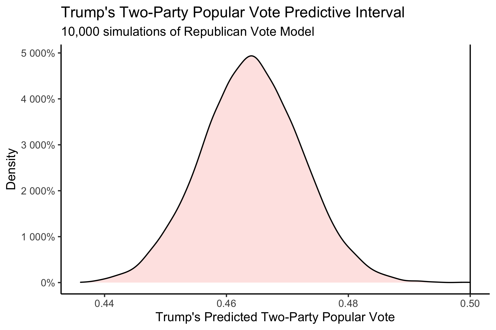

# Post-Election Reflection

## November 23, 2020

<br>

### Recap of My Model:

***Biden was predicted to win both the National Popular Vote and the Electoral College.***

#### National Prediction

This model predicted Republican Two-Party Vote Share from just two variables: the last Republican Two-Party Vote Share (from the last Presidential Election) and the Republican Weighted Poll Average. 

With coefficients, this was the national-level regression:

```
Rep. Two-Party PV = 0.072 + 0.122 * Last Rep. Two-Party PV + 0.736 * Rep. Weighted Poll Avg.
```

My final estimate was that Trump would receive a Two-Party Vote Share of 0.464 with a 95% Confidence Interval of (0.445 - 0.482), and Biden would receive a Two-Party Vote Share of 0.536 with a 95% Confidence Interval of (0.518 - 0.555). 

The distribution of outcomes from 10,000 simulations are shown below:



This model predicted that it was near-impossible for Trump to win the National Popular Vote.

#### State-Level Predictions

This model predicted Republican Two-Party Vote Share from the last Republican Two-Party Vote Share, the Republican Weighted Poll Average, Republican Incumbent, and White Percent of Population.

With coefficients, this was the state-level regression: 

```
Rep. Two-Party PV = -0.063 + 0.157 * Last Rep. Two-Party PV + 0.929 * Rep. Weighted Poll Avg. - 0.003 * Rep. Incumbent + 0.030 * White Percent of Population
```

This produced the following Electoral College Map Prediction:


However, some of these races were predicted to be extremely close, so I instead decided to color in the map by breaking down certainty. Those breaks were Solid (predicted to win by >10%), Lean (predicted to win b y >5%), and Toss-Up (within 5%). This break-down produced the following map:


We can see that the model narrowly predicted that Biden wins in some key battleground states, like Georgia, Arizona, North Carolina, and Florida, whereas Trump was predicted to narrowly win in other battleground states like Texas, Ohio, and Iowa. Notably, this model predicted that the Midwestern States that Trump had won in 2016 would flip back to Biden, and that he would win by more than 5%. Because these states had pushed Biden over 270 electoral votes, I had not actually shared the first map in my final prediction, as I wanted people to know that the 7 battelground states that I colored in gold were predicted to be extremely close races, while still showing that Biden was predicted to win. However, I am including it here for the purposes of showing the actual predicted winner in those states so that I can compare model accuracy to the actual election results.

For a final Electoral Vote Prediction, the model predicted that Trump would receive 188 Electoral Votes with a 95% Confidence Interval of (150 - 204) and Biden would receive 350 Electoral Votes with a 95% Confidence Interval of (334 - 388). This essentially predicts a landslide victory for Biden. However, due to the extremely close races in the key battleground states, I felt that these confidence intervals were still a bit smaller than I'd expect. As a result, what I did instead was calculate the out-of-sample margin of error from the 25% testing split I'd used, and then use that margin of error to calculate a wider confidence interval. These 95% Confidence Intervals were (114 - 325) Electoral Votes for Trump and (213 - 424) for Biden. This means that with the revised confidence intervals, Trump was still predicted to lose, but it was indeed within the range of uncertainty for him to win the Electoral College.

### Model Accuracy

### Proposed Hypotheses

### Proposed Quantitative Tests

### How Would I Change My Model?


