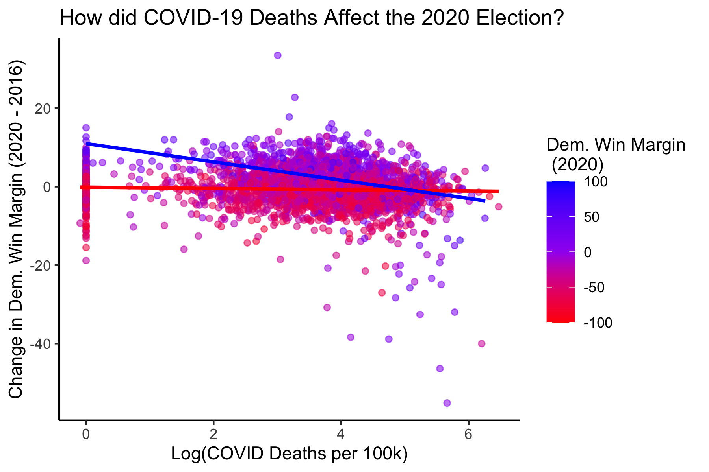

# Media Narrative

## December 10, 2020

 

### Background

A post-election narrative is a story that is popularized by the media to explain some result of the election. For this blog, I will focus on the media narrative that COVID-19 actually helped Trump in this election.

Before the election, it was almost universally accepted that the effects of the pandemic would help Biden win the election. In this [UCLA Newsroom article](https://newsroom.ucla.edu/releases/covid-19-death-rates-election-voting) by Jessica Wolf, pre-election voter surveys indicated that there was a decline in support for the GOP from January to June in states with the highest rates of COVID-19 deaths. The article draws on a study by [Warsaw, Vavreck, and Baxter-King](https://advances.sciencemag.org/content/6/44/eabd8564/tab-pdf), and Vavreck asserted that such trends continued into mid-Septmeber. If the trends in this study were correct, and support for the GOP and Trump truly did decrease as COVID-19 ravaged on, then we would expect Trump's support in 2020 to be lower than it was in the 2016 election as well (Although, an argument could be made that this would not be a perfect comparison as Trump faces Biden as opposed to Clinton this year).

While Biden did indeed win the election, he did not win in the landslide that was predicted by most. How did the media account for this? 

### The Narrative

Rather than causing the landslide for Biden that was expected, the effects of COVID-19 perhaps had the inverse effect. The story coming out after election night was that COVID-19 actually helped Trump. [NPR](https://www.npr.org/sections/health-shots/2020/11/06/930897912/many-places-hard-hit-by-covid-19-leaned-more-toward-trump-in-2020-than-2016) claims that those counties hit hardest by COVID-19 in terms of death rate actually leaned more towards Trump than they previously did. [AP News](https://apnews.com/article/counties-worst-virus-surges-voted-trump-d671a483534024b5486715da6edb6ebf) makes similar claims, and highlights the increasing disparity between COVID-19 perceptions between Biden and Trump voters: those that voted for Biden mostly see that pandemic as not under control at all, whereas those that voted for Trump mostly see the pandemic as at least somewhat under control.

Why is this narrative important to test? Many models did not account for shocks, mainly because they are wildly uncontrollable. The most obvious shock this year was COVID-19. However, in almost every respect, we expected COVID-19 to hurt President Trump's performance in the election, from the economic effects, to the health effects, to deaths. Testing this narrative would allow us to see how this shock, arguably the most important and influential shock in recent history, affected the outcome of this election.

### The Data

Coronavirus Data is from [Johns Hopkins University](https://github.com/CSSEGISandData/COVID-19/blob/master/csse_covid_19_data/README.md). Election data is from county-level election returns in 2016 and 2020. Because the media narrative focuses on death rate, I used that variable in my test, but there was also data included about case rates and case-fatality rates. 

### Testable Implications

The best way to test this narrative would be to look at support for Trump over time at the county level. As COVID-19 rates increased, we would expect support for Trump to decrease. This is what Warsaw et. al. attempted to do pre-election. However, if the results of the 2020 election have taught us one thing, it's that the polls (and likely the voter-surveys used by Warsaw et. al.) were wrong again. This election, they were worse than they were in 2016. Because of this, it does not seem like the most thorough way of testing this claim, especially considering that Trump consistently outperformed his polling numbers.

What we could do instead, would be to look at the difference in a county's vote in 2020 compared to in 2016. While this certainly isn't a perfect approach (again, Trump faces off againt different candidates), it may be the best we can do.

If the media narrative is correct that an increase in COVID-19 death rates actually led to more support for Trump, then we should notice that on the county level, those with higher rates of COVID-19 would vote in higher proportions for Trump in 2020 than they did in 2016. This is because if COVID-19 truly did bolster support for Trump, we would expect counties to vote for him in larger numbers than they had previously in 2016.

### Some Important Caveats

The purpose of this blog is not to give a definitive answer to whether or not the media narrative is true. Instead, I will provide explanations and analysis as to whether or not the data initially support the media narrative. There are plenty of confounding variables that may affect the variables in question. For instance, increasing polarization may lead to red states becoming more Republican, and blue states becoming more Democratic. Increasing polarization may also lead to red states becoming hotspots for COVID-19 once mask-wearing became politicized, whereas blue states may recover more because of the same effect. I will attempt to look at this one confounding variable (albeit in a somewhat circular fashion due to a lack of current data), but note that there are many more. Again, the analysis provided here will not be determinative, but instead only exploratory.

Also, due to the wide range of values for COVID-19 related variables (eg. deaths, cases, and both rates), I have created new variables with the log of each. However, because many counties have not reported any deaths, the log variable was calculated as -Inf (since the log(0) is impossible), so I recoded these as 0 (even though that would technically indicate 1 death).

### An Exploration of A Possible Confounding Variable

One important consideration is that of polarization. We know that in recent years, conservatives have been becoming more conservative, and liberals have become more liberal. If we can show that liberal counties have lower rates of COVID-19 and conservative counties have higher rates of COVID-19, then it would be likely that counties with higher rates of COVID-19 also leaned more towards Trump in 2020 not because of COVID-19, but because of polarization.

In this graph, we can see that counties with a higher Democratic win margins in 2016 have higher COVID-19 death rates (per 100k). This is the opposite of what we would expect if polarization was the confounding variable explaining the association between COVID-19 death rates and increase in Trump support in 2020. (Although not graphed, using Democratic win margins in 2020 rather than in 2016 yields nearly identical results).

This shows that polarization is likely not a confounding variable for this relationship, meaning that the media narrative may indeed be true. With this confounding variable out of the way (although there certainly may be more), we can begin to test the implication.

### Testing the Implication

Now we need to investigate whether or not counties with higher COVID-19 death rates truly did shift towards Trump in 2020 compared to 2016. To check these, I calculated the change in each county's Democratic Win Margin (2020 - 2016). A positive value indicates that a county voted more Democratic in 2020 compared to 2016. A negative value indicates that a county voted more Republican in 2020 compared to 2016. Plotting this as our dependent variable against COVID-19 death rates will give us a better picture of whether or not the two variables are associated with one another.

Additionally plotted are two regression lines: One for counties which voted for Trump in 2016, and one for counties which voted for Clinton in 2016. The purpose of this differentiation is to show that the trend is not skewed by the large number of Republican counties (which typically have fewer people) and smaller number of Democratic counties (which typically have more people).

As we can see, there is indeed a negative association between COVID-19 death rate and more Democratic support. This means that there is a positive association between COVID-19 death rate and an increase in support for Trump. 

This trend appears most clearly in Democratic counties, as differentiated by their 2016 vote. It is interesting to note that the trend-line for Republican counties, while slightly positive, is almost flat, indicating that perhaps there was no effect of COVID-19 death rates on Trump's change in support for Republican counties. It is also interesting to note that the Republican trend-line is almost equal to y = 0, indicating that Republican counties on average voted that same as they did in 2016.

The regression lines were given by the following equations:

Democratic Counties: 
`change = 10.8098 - 2.585(log_death_rate)`

Republican Counties: 
`change = -0.088 - 0.0911(log_death_rate)`

For both, the intercept and slope are statistically significant.

The overall correlation between the two variables is -0.1052, indicating a slightly negative correlation.
When we separate into Democratic & Republican counties, we see that the correlation for Democratic counties is stronger (-0.4033) compared to Republican counties (-0.0291).

This tells us that overall, the data initially seems to support the media narrative. However, upon closer inspection, the media narrative really only seems to hold for Democratic counties. Why might this be?

### Considerations of Possible Explanations

We saw that as COVID-19 deaths rates increased, Democratic counties experienced greater shifts towards Trump. Republican counties also followed this trend, but not to such a large extent, staying about the same from 2016 to 2020. Again, we haven't explored all of the possible confounding variables -- there may be something hidden that explains this relationship that does not rely on a direct causation between the two.

But, if we were looking to agree with the media narrative, we may consider the following argument: Democratic counties with large death rates were those that were more likely to experience shutdowns (as a result of having Democratic politicians in power). Democratic counties without large death rates may not have had shutdowns because COVID-19 was under control. Republican counties may not have had shutdowns because COVID-19 was politicized and Republicans became staunchly anti-shutdown. Because of this, we may have seen people become averse to shutdowns -- and perhaps they blamed the Democratic party for that more than they blamed the Republicans for the spread of COVID-19. Independents and Republicans in counties with shutdowns may have turned out in larger numbers to support Trump. As a result, we would see that there would be a greater effect of COVID-19 death rate on an increase in Trump support in Democratic counties because of reactance to shutdowns. This would not happen in Republican counties because there 1) either weren't shutdowns or 2) they already disliked Democrats, so even if they blamed Democrats for shutdowns, it wouldn't have changed their voting.

Again, this is just a theory to support the media narrative. More data would need to be collected about shutdowns, and perhaps protests to those shutdowns, to corroborate this theory.

