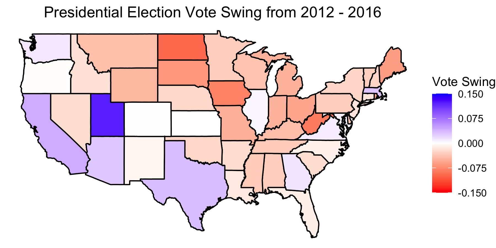
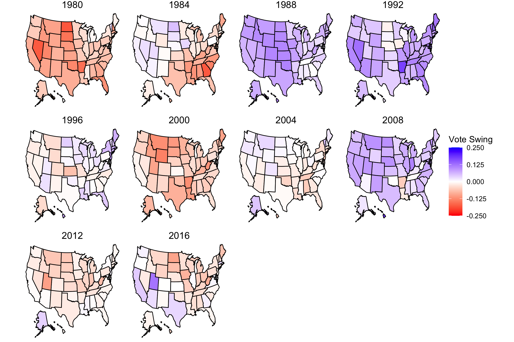
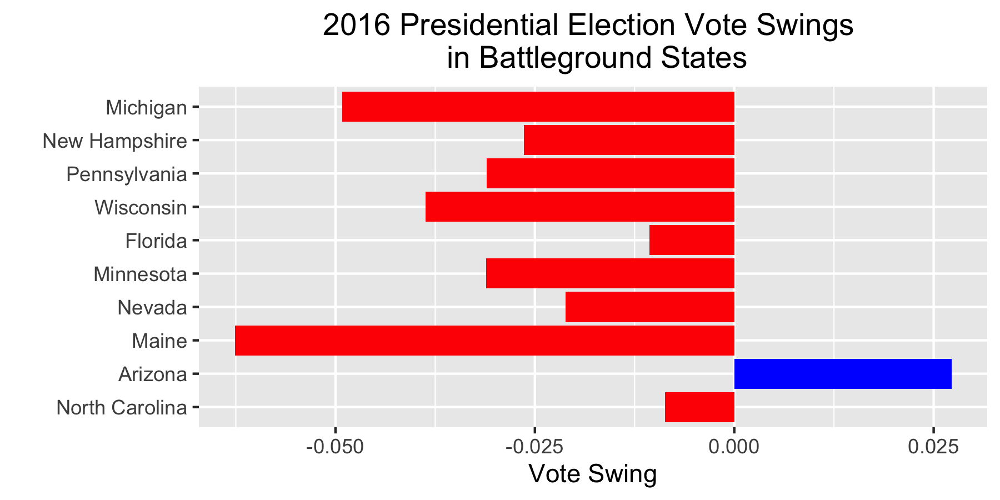

# Introduction: Past Elections

## September 11, 2020

  

### Election History

It is important for us to look at historical trends in order to better inform ourselves on current and future trends. For this reason, this introductory blog post will focus exclusively on past elections. Rather than trying to predict the 2020 election with models, this week, I will simply look at trends from past elections. Specifically, I will look at states which have recently become swing states.

### Swing States

For the purposes of this post, "vote swing," or simply "swing," refers to the difference in a state's voting proportions from election to election. Here, we will focus on each state's Democratic swing (i.e. the difference in the state's proportion of votes that go to the Democratic Candidate in the Presidential Election from the last election to this election). In this way, **"Swing State" will refer to a state that has experienced a large swing in favor of either the Democratic or Republican Candidate**. This is different from the other definition of a "Swing State" where we look at how close the election seems. Mathematically, this can be calculated as:

(Dy / (Dy+Ry)) - (Dy-4 / (Dy-4+Ry-4))

where Dy and Ry are the number of votes for the Democratic Candidate and Republican Candidate in the current election, and Dy-4 and Ry-4 are the number of votes for the Democratic Candidate and Republican Candidate in the prior election. **Note that a positive value means that the state has swung more Democratic, and a negative value means that the state has swung more Republican**. 

 
#### 2016 Election Swing
  

The more blue that a state is, the more that their votes swung in favor of the Democratic Candidate in 2016 compared to 2012. The more red that a state is, the more that their votes swung in favor of the Republican Candidate in 2016 compared to 2012. *This does not mean that the state voted the way that it swung*, but rather that *the state's proportion of votes has shifted more that way*. For example, from 2012 to 2016, we can see that Utah swung more Democratic, but it still voted Republican, and that New York swung more Republican, but it still voted Democratic. 

States that swung the most from 2012 to 2016:

* **Utah** with a swing of 0.122 (*+D*). In what is usually a Republican stronghold, Trump won with much less support than Romney had earned from the state in 2012. In 2016, [Time](https://time.com/4397192/donald-trump-utah-gary-johnson/) speculated that Utah's Mormon values kept many Republicans from voting for Trump.
* **North Dakota** with a swing of -0.097 (*+R*)
* **West Virginia** with a swing of -0.0849 (*+R*)
* **Iowa** with a swing of -0.0802 (*+R*)
* **South Dakota** with a swing of -0.675 (*+R*)
* **Maine** with a swing of -0.0626 (*+R*)
* **Ohio** with a swing of -0.0578 (*+R*). Just one of many Midwest states that Clinton was unable to win, [Real Clear Politics](https://www.realclearpolitics.com/articles/2017/01/19/how_trump_won_the_midwest_132834.html) says that Democratic support in rural Midwestern areas dropped significantly from 2012 to 2016.
* **Rhode Island** with a swing of -0.0571 (*+R*)
* **Missouri** with a swing of -0.0504 (*+R*)
* **Michigan** with a swing of -0.0492 (*+R*). In what was one of the closer states in 2016, [Politico](https://www.politico.com/story/2016/12/michigan-hillary-clinton-trump-232547) blames poor Democratic campaign management, among many other factors, for Michigan's swing towards Trump.

It is interesting to note that only one of these ten states swung more Democratic. This tells us that 1) Trump did a much better job of swinging voters who had voted for Obama and retaining voters who had voted for Romney; and 2) Clinton did a poor job of swinging voters who had voted for Romney and retaining voters who had voted for Obama.

 
### Modern Election Swings (1980 to 2016)
  

In 1980, 2000, and 2012, the maps are almost completely red, meaning that almost all of the 50 states during those years swung more Republican compared to the previous election.

* **1980, Ronald Reagan vs. Jimmy Carter**: In **[Three Trends Over Eight Presidential Elections, 1980–2008: Toward the Emergence of a Democratic Majority Realignment?](https://www-jstor-org.ezp-prod1.hul.harvard.edu/stable/25655695)**, Caraley states that in 1980, people had become much more likely to split their tickets, voting for the candidate rather than the party. Coupled with Reagan's popularity, this led to many states swinging more Republican.
* **2000, George W. Bush vs. Al Gore**: Despite the infamous recount and controversy that Gore had actually won the popular vote, most states in 2000 actually swung more Republican. [Caraley](https://www-jstor-org.ezp-prod1.hul.harvard.edu/stable/25655695) cites Gore's ineffective campaign as reason for Bush's flipping of 11 states which had voted Democratic in 1996.
* **2012, Mitt Romney vs. Barack Obama**: In **[The decline in the white vote for Barack Obama in 2012: Racial attitudes or the economy?](https://doi.org/10.1016/j.electstud.2014.09.014)**, Weisberg notes that the economy led to a decline in his support from white voters in 2012.

In 1988, 1992, and 2008, the maps are almost completely blue, meaning that almost all of the 50 states during those years swung more Democratic compared to the previous election.

* **1988, George H.W. Bush vs. Michael Dukakis**: [Caraley](https://www-jstor-org.ezp-prod1.hul.harvard.edu/stable/25655695) notes that Reagan won 1984 in a landslide election. The swing here may just be an artefact from the fact that 1984 was a landslide election for Reagan. 
* **1992, George H.W. Bush vs. Bill Clinton**: In **[The Political Nor'easter of 1992: A Northeastern USA Critical Election?](http://search.proquest.com.ezp-prod1.hul.harvard.edu/docview/2204514794?accountid=11311)**, Tures notes that this was a critical election in which the Northeast became a Democratic stronghold. It would also appear that Clinton was more popular across the country compared to Dukakis.
* **2008, John McCain vs. Barack Obama**: [Caraley](https://www-jstor-org.ezp-prod1.hul.harvard.edu/stable/25655695) notes Obama's ability to win over voters in Republican strongholds such as North Carolina, Virginia, and Indiana. Coupled with strong support from Black Americans who showed up in stronger numebers, Obama was able to swing many states more Democratic.

 
#### Battleground State Swings
 

For the purposes of this post, I've defined "battleground states" as states whose Two-Party-Vote-Shares differ by no more than 5%. 10 states are thus defined as battleground states.

In this graphic, the battleground states are listed by how close the 2016 Presidential Election was, with Michigan the closest. Out of the 10 battleground states, only one, Arizona, swung more Democratic. All of the rest swung more Republican. If these trends continue, Trump's lead in those battleground states will continue to grow. However, it is important to note that the 2016 states that swung more Republican are representative of both how many votes Trump gained compared to Romney, *and* how many votes Clinton lost compared to Obama. During the next election, we will see how many votes Trump has retained *and* how many votes Biden receives compared to Clinton. If Biden can win back ground lost by Clinton, then these trends may be reversed.

Most of these battleground states have swung more Republican in 2012 and 2016, but some have also swung more Democratic in 2000-2008. If Biden can build on the trends that pushed states to swing more towards Obama, he may stand a chance. If Trump continues to swing states more Republican, he will further strengthen his base.