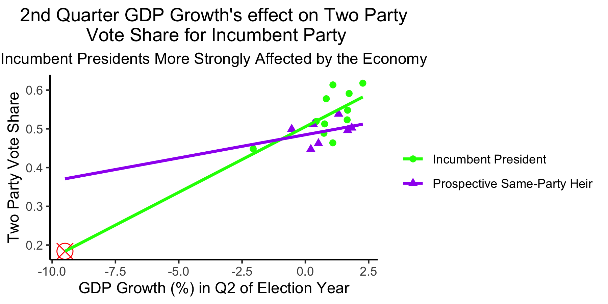
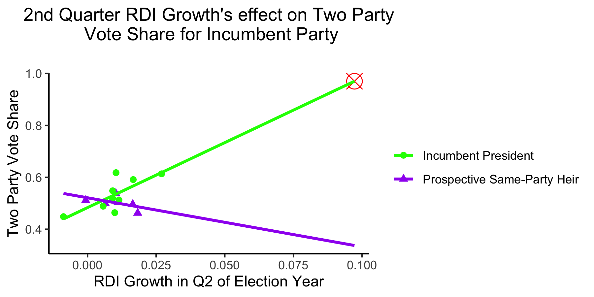
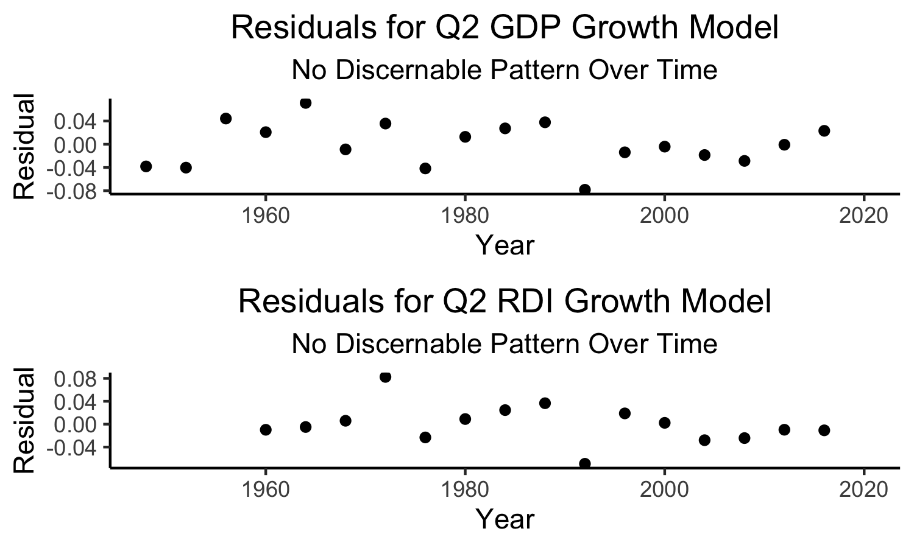

# Economy

## September 18, 2020

<br>

### Background

**The idea that voters use past information to inform their future voting decisions is known as the retrospective theory**. As posited in [*Democracy for Realists*](https://muse-jhu-edu.ezp-prod1.hul.harvard.edu/chapter/2341025) by Christopher Achen and Larry Bartels, voters likely use economic information to inform their voting decisions. [Achen and Bartels](https://muse-jhu-edu.ezp-prod1.hul.harvard.edu/chapter/2341029) introduced their model to explain the incumbent party's popular vote margin by using the *Q14-Q15* (14th Quarter - 15th Quarter of the President's term, equivalent to election year Q2) growth in *real disposable income* per capita (RDI: average amount of income a person takes home after taxes), because this statistic usually accounts for many other economic factors, such as *inflation*, *taxes*, and *unemployment*. There is significant evidence to suggest that these short-term growths late in the Presidential term have a positive impact on the incumbent party's margin of the popular vote. 

First we want to investigate the effect of the economy on elections. We also want to see whether or not the effect of the economy is stronger for **incumbent presidents** compared to **prospective same-party heirs (those of the same party as the outgoing president -- e.g. John McCain in 2008 and Hillary Clinton in 2016)**. Finally, we'll explore whether or not the models' predictive power changes over time.

### Economic Factors

Here I've focused on national economic statistics. Due to the research by [Achen and Bartels](https://muse-jhu-edu.ezp-prod1.hul.harvard.edu/chapter/2341029), I've selected 2nd Quarter Growth in *GDP* (Gross Domestic Product -- the total value of goods and services in the time period) and *RDI* (Read Disposable Income, as defined earlier). 

These assume that voting behavior with regards to the economy is:
* *Indirect*: **Voters look generally at the economy**, rather than at specific, direct effects of economic policies. GDP and RDI are good variables for broad generalizations of the economy. This means that economy may be a proxy for other variables of importance.
* *Partially Informed*: **Voters do not understand everything about the economy and do not have a perfectly rational view of the past to inform their decisions**. This is why Q2 of the election year is only referenced, as myopic retrospection indicates that more recent developments are more likely to influence decisions. [Healy and Lenz](https://www.jstor.org/stable/24363467) explain that this phenomenon is largely psychological, as most experiences are judged by their peak and their end.
* *Sociotropic*: Voters vote with others in mind, not just their own economic conditions. Ideally, we could have data on an individual level, where we could see whether each voter lost income, lost their job, etc. (In that case, we may assume voters are Individual). **However, because we use aggregate data on the national level for the model, we must assume that voters are sociotropic on the national level**.

Note that if we were to change our model of voting behavior, we would select different variables, and thus our entire models would be different.

#### Q2 GDP Growth Model:



**This model is unhelpful for predicting the 2020 election due to extreme extrapolation.**

**Incumbent presidents are more strongly affected by the economy compared to prospective same-party heirs**.

In this model, we predict the incumbent party's two party vote share from the GDP Growth during Q2 of the election year. The data is split into two categories: Incumbent President and Prospective Same-Party Heir. As we can see from the model, the Incumbent Presidents' Two Party Vote Share is more strongly affected by Q2 GDP Growth compared to the Prospective Same-Party Heirs' Two Party Vote Share. While Q2 GDP Growth is positively associated with the incumbent party two party vote share, there is a stronger effect for incumbent presidents (coef. = 0.03385) compared to prospective same-party heirs (coef. = 0.01197). So, for every 1% increase in Q2 GDP Growth, the model predicts a 3.385% increase in two party vote share for an incumbent president, but only a 1.197% increase in two party vote share for a prospective same-party heir.

Incumbent President:
```
(Predicted Two Party Vote Share) = 0.03385(Q2 GDP Growth %) + 0.50540
```
Prospective Same-Party Heir:
```
(Predicted Two Party Vote Share) = (0.03385 - 0.02188)(Q2 GDP Growth %) + 0.50540
```


Because there are few observations, rather than training and testing the model, I am going to instead evaluate it by its R-Squared coefficient: 0.4916. This is a moderate R-Squared value, indicating that our model is not great, but also not awful.

**Since the 2020 Q2 GDP Growth is approximately -10%, which is far outside the range of our model's values (-2.5% to 2.5%), we should be extremely cautious of the predicted value of the two party vote share**. With a Q2 GDP Growth of -10%, the model predicts Trump will only receive *less than 20%* of the two party vote share (indicated by the red crosshairs). This is extremely low. However, because we had to extrapolate from our model, this is very imprecise, and should not be used as a solid prediction. 

#### Q2 RDI Growth Model:



**This model is unhelpful for predicting the 2020 election due to extreme extrapolation.**

In this model, we predict the incumbent party's two vote share from the RDI Growth during Q2 of the election year. The data is again split into the same two categories of Incumbent President and Prospective Same-Party Heir. This model actually predicts that Prospective Same-Party Heirs are *hurt* by gains in RDI during Q2 of the election year, which seems counterintuitive. This inaccuracy is likely due to the fact that we only have data on RDI for 6 elections with Prospective Same-Party Heirs. Specifically, for every .01% increase in Q2 RDI Growth, the model predicts a 5.0068% increase in two party vote share for an incumbent president, compared to a 1.8903% decrease in two party vote share for a prospective same-party heir.

Incumbent President:
```
(Predicted Two Party Vote Share) = 5.00680(Q2 RDI Growth %) + 0.48333
```
Prospective Same-Party Heir:
```
(Predicted Two Party Vote Share) = (5.00680-6.89717)(Q2 RDI Growth %) + 0.48333
```


Again, because of the limited number of observations, I am going to evaluate this model by its R-Squared value: 0.5778. This is also a moderate R-Squared value, again indicating that our model is not great, but not awful.

**Since the 2020 Q2 RDI Growth is approximately 0.1%, which is far outside the range of our model's values (-0.01% to 0.027%), we should again be extremely cautious of the predicted value of the two party vote share**. With a Q2 RDI Growth of ~0.1%, the model predicts Trump will receive *almost 100%* of the two party vote share (indicated by the red crosshairs). This is extremely high. Again, because we had to extrapolate from our model, this is also imprecise, and should not be used as a solid prediction.

#### Residuals

We should also check to see if the predictive powers of the models vary significantly over time. To check this, we plot the residuals of our data over time. If there is a clear pattern, then there is evidence to suggest that the models are better predictors for some time periods compared to others.



**Since there is no clear pattern over time, then our models' predictive powers do not significantly vary over time**.

#### Why Should We Be Cautious?

**The economy may not be the best for helping us to predict the 2020 election.**

2020 is not a typical year by any means. Because of the Coronavirus Pandemic, statistics of our economy are extremely different compared to prior election years. These extreme statistics are not within the range of our models, and thus, our models' predictive powers for 2020 are not going to be strong. As [The Economist](https://projects.economist.com/us-2020-forecast/president/how-this-works) notes, "History provides no guide as to how voters will respond to these extreme and potentially fast-reversing economic conditions." 

Even though the economy has been, and probably still remains, a key factor in voters' retrospective decision-making processes, this year is unlike any other in modern election history. As a result, I will remain cautious about using national economic variables, for which the 2020 election is a huge outlier.

All in all, because of the extreme economic effects of the Coronavirus Pandemic, the economy does not seem to predict the 2020 election well on a national level.

###### Data Sources:
GDP data is from the US Bureau of Economic Analysis and the Department of Commerce
RDI data is from the US Bureau of Economic Analysis
