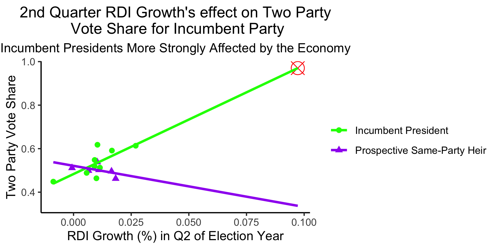

# Economy

## September 18, 2020

 

### Background

The idea that voters use past information to inform their voting decisions is known as the **retrospective theory**. As posited in [*Democracy for Realists*](https://muse-jhu-edu.ezp-prod1.hul.harvard.edu/chapter/2341025) by Christopher Achen and Larry Bartels, voters may use economic information to inform their voting decisions. The idea is nothing new; leaders have known for centuries that the economy is a pressing matter to citizens. [Achen and Bartels](https://muse-jhu-edu.ezp-prod1.hul.harvard.edu/chapter/2341029) introduced their model to explain the incumbent party's popular vote margin by using the *Q14-Q15* (14th Quarter - 15th Quarter of the President's term) growth in *real disposable income* per capita (average amount of income a person takes home after taxes), because this statistic usually accounts for many other economic factors, such as *inflation*, *taxes*, and *unemployment*. There is significant evidence to suggest that these short-term growths late in the Presidential term have a positive impact on the incumbent party's margin of the popular vote. 
First we want to investigate the effect of the economy on elections. We also want to see whether or not the effect of the economy is stronger for incumbent presidents compared to prospective same-party heirs (those of the same party as the outgoing president -- e.g. John McCain in 2008 and Hillary Clinton in 2016).

### Economic Factors

Here I've focused on national economic statistics. Due to the research by [Achen and Bartels](https://muse-jhu-edu.ezp-prod1.hul.harvard.edu/chapter/2341029), I've selected 2nd Quarter Growth in *GDP* (Gross Domestic Product -- the total value of goods and services in the time period) and *RDI* (Read Disposable Income). The research suggests that voters TODO TODO TODO TODO

#### Q2 GDP Growth Model:

**This model is unhelpful for predicting the 2020 election due to extreme extrapolation.**

In this model, we predict the incumbent party's two party vote share from the GDP Growth during Q2 of the election year. The data is split into two categories: Incumbent President and Prospective Same-Party Heir. As we can see from the model, the Incumbent Presidents' Two Party Vote Share is more strongly affected by Q2 GDP Growth compared to the Prospective Same-Party Heirs' Two Party Vote Share.

Because there are few observations, rather than training and testing the model, I am going to instead evaluate it by its R2 coefficient: 0.4916. This is a moderate R2 value, indicating that our model is not great, but also not awful.

Since the 2020 Q2 GDP Growth is approximately -10%, which is far outside the range of our model's values (-2.5% to 2.5%), we should be extremely cautious of the predicted value of the two party vote share. With a Q2 GDP Growth of -10%, the model predicts an Incumbent President to only receive *less than 20%* of the two party vote share. This is extremely low. However, because we had to extrapolate from our model, this is very imprecise, and should not be used as a solid prediction.

#### Q2 RDI Growth Model:

**This model is unhelpful for predicting the 2020 election due to extreme extrapolation.**

In this model, we predict the incumbent party's two vote share from the RDI Growth during Q2 of the election year. The data is again split into the same two categories of Incumbent President and Prospective Same-Party Heir. This model actually predicts that Prospective Same-Party Heirs are *hurt* by gains in RDI during Q2 of the election year, which seems counterintuitive. This inaccuracy is likely due to the fact that we only have data on RDI for 6 elections with Prospective Same-Party Heirs. 

Again, because of the limited number of observations, I am going to evaluate this model by its R2 value: 0.5778. This is also a moderate R2 value, again indicating that our model is not great, but not awful.

Since the 2020 Q2 RDI Growth is approximately 0.1%, which is far outside the range of our model's values (-0.01% to 0.027%), we should again be extremely cautious of the predicted value of the two party vote share. With a Q2 RDI Growth of ~0.1%, the model predicts an Incumbent President to receive *almost 100%* of the two party vote share. This is extremely high. Again, because we had to extrapolate from our model, this is also imprecise, and should not be used as a solid prediction. 

#### Why Should We Be Cautious?

2020 is not a typical year by any means. Because of the Coronavirus Pandemic, statistics of our economy are extremely different compared to prior election years. These extreme statistics are not within the range of our models, and thus, our models' predictive powers for 2020 are not going to be strong. As [The Economist](https://projects.economist.com/us-2020-forecast/president/how-this-works) notes, "History provides no guide as to how voters will respond to these extreme and potentially fast-reversing economic conditions."

