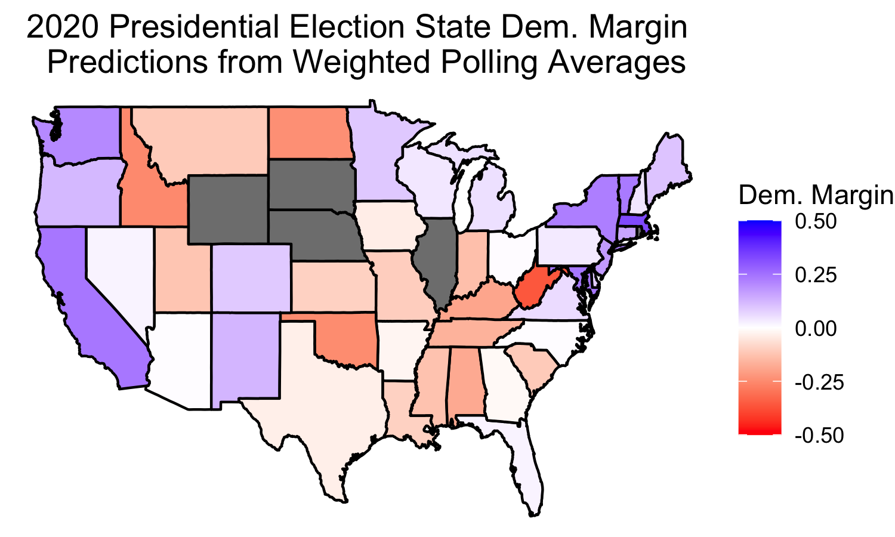
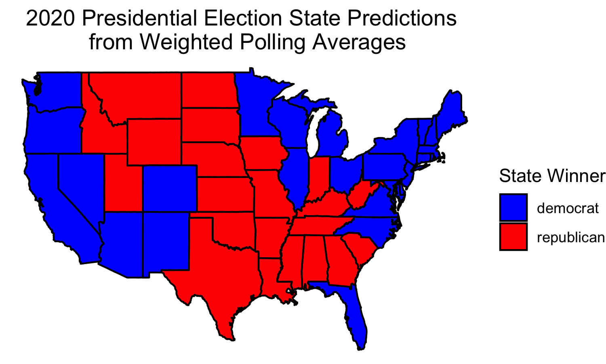
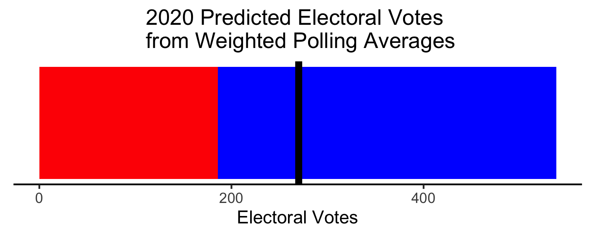
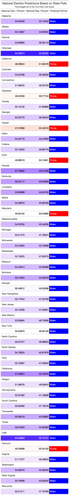
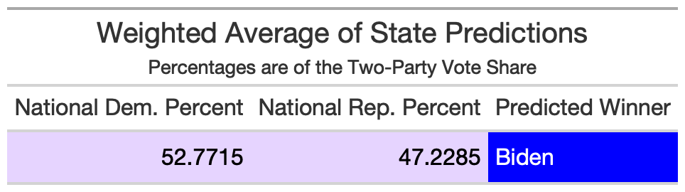

# Polling

## September 25, 2020

<br>

### Background

**Polling is one of the only ways for us to gauge public opinion on people's preferences for their elected officials, but we should be cautious, as polls are sometimes inaccurate.**

Infamously, the polls for the 2016 predicted a decisive win for Clinton, only for her to be upset by Trump. While Clinton did indeed win the national popular vote, Trump handily won the Electoral College. Forecaster [Nate Silver](https://fivethirtyeight.com/features/how-fivethirtyeights-2020-presidential-forecast-works-and-whats-different-because-of-covid-19/) defended his model, saying that it did give Trump a 30% chance of winning, which, although not above 50%, is still a decent chance. The [New York Times](https://www.nytimes.com/2017/05/31/upshot/a-2016-review-why-key-state-polls-were-wrong-about-trump.html) notes that inaccurate polls did not correctly weight their survey samples, as uneducated white people were underrepresented in polls. They also define a "shy Trump" effect: Trump supporters were embarrassed to share their true preferences in surveys. This is also knows as preference falsification, as noted by [Tim Kuran in his article **The Inevitability of Future Revolutionary Surprises**] (https://www.jstor.org/stable/2782680): "a person has a private preference and a public preference. When the two differ, the individual is engaged in preference falsification." If someone knows their private preference is not the socially acceptable one, they will falsify their public preference.

In 2016, preference for Trump was seen as not the socially acceptable option. However, in 2020, because Trump won the 2016 election, this may no longer be the case. Thus, Trump supporters may be more willing to share their private preference and tell the truth at polls. **This may give us more hope that 2020 polls are more accurate than the 2016 polls were.**

### Polling Decisions

#### State Polls vs. National Polls

**There is evidence that aggregating state polls may be more accurate than simply using national polls.**

According to [FiveThirtyEight](https://fivethirtyeight.com/features/what-state-polls-can-tell-us-about-the-national-race/), state polls do a better job of capturing representative samples compared to national polls. Nate Silver demonstrates how if we know how a state typically votes relative to the nation as a whole, we can use state polls to predict the national election.

#### How Do States Typically Vote Relative to the Nation?

**Using weighted proportions, we can predict how a state will vote relative to the nation as a whole in 2020.**

Silver predicts Biden's margin using 2016 results and 2012 results separately. My goal was to use both 2016 and 2012 results in order to first predict how much more/less Democratic/Republican a state would be in 2020, and then predict the national vote.

I will use the term *lean* to describe how much more/less Democratic/Republican a state is compared to the nation.

First, I calculated the Democratic and Republican lean for each state in 2012 and 2016. Then, using a k-NN regression with k = 2, I iterated through possible coefficients (A, B, C, and D) ranging from 0 to 1 for these values for each state. Looking at the MSE for each coefficient pairing, I was able to select the best model for each state by minimizing the MSE.

Thus, for each state, we have the equations:
```
Democratic_Lean_2020 = A * Democratic_Lean_2012 + B * Democratic_Lean_2016 
```
and 
```
Republican_Lean_2020 = C * Republican_Lean_2012 + D * Republican_Lean_2016
```
where A, B, C, and D are calculated minimizing the MSE. A positive Democratic/Republican lean indicates that the state votes more Democratic/Republican than the nation. A negative lean means the opposite.

#### How Can We Find A Weighted Average for State Polls?

Again, [FiveThirtyEight](https://fivethirtyeight.com/features/the-polls-are-all-right/) says that **polls get more accurate as we get closer to the election.**

While this may tempt us to only use the most recent poll to estimate the Democratic and Republican Proportions within each state, we also know from FiveThirtyEight that aggregate poll averages are often more accurate than a single poll.

Thus, we are going to weight polls by their recency and add them together to find a weighted average. I'll spare the mathematical calculations, but essentially, more recent polls contribute more to the average than older polls.

Using these averages, we can predict the Presidential vote within each state. Here is a map of such predictions:



Note that we did not have polls for all states, so those states are in grey to indicate missing values.

We can also use these to predict the winner in each state, giving us an electoral map:



Note that for the missing states above, I filled in their predicted winner with the party they voted for in 2016. (These were all pretty decisive victories, so I feel comfortable doing so -- If these were less decisive, I would have left these out). Biden is predicted to win most key battleground states: Michigan, Wisconsin, New Hampshire, Pennsylvania, Ohio, North Carolina, Virginia, Florida, and Arizona. Trump is predicted to win Iowa and Georgia.

This gives us the following electoral breakdown:



This indicates a major Electoral College victory for Biden.

#### How Can We Predict the National Vote From the State Polls?

Using these equations, we could plug in the partisan leans from the two previous elections to predict the partisan leans in 2020.

Then using the equations:
```
National_Democratic_Proportion = State_Democratic_Proportion - Democratic_Lean_2020
```
and 
```
National_Republican_Proportion = State_Republican_Proportion - Republican_Lean_2020
```
where the State Democratic/Republican Proportions are given by the polling averages within each state, we can predict the National vote. 

Converting these proportions into the Two-Party Vote Share, we predict the following results:



Note that only five state polls thus predict a Trump popular vote win. Also note that these are significantly less decisive victories than those for Biden.

With a weighted average of these national predictions by 2016 Turnout, we get the following prediction for the Two-Party Popular Vote Share:



### Final Prediction Based on State Polls

So our prediction based off of state polls is:


Electoral Vote: Biden Wins (352 - 186)

Two-Party Popular Vote: Biden Wins (52.77% to 47.23%)


