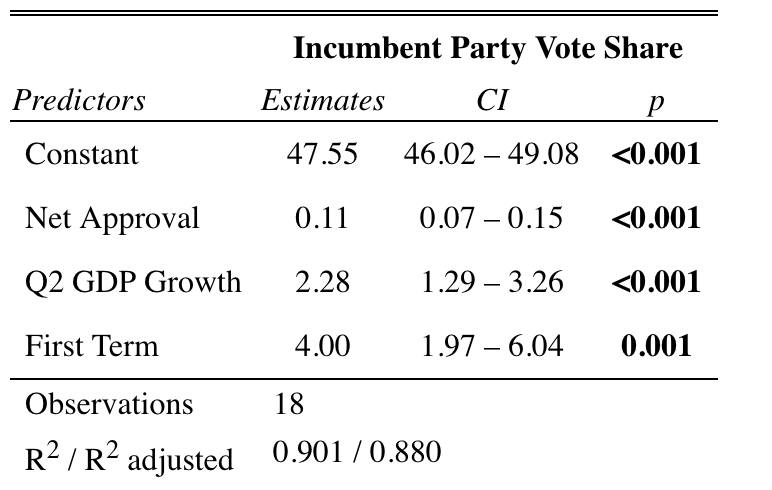
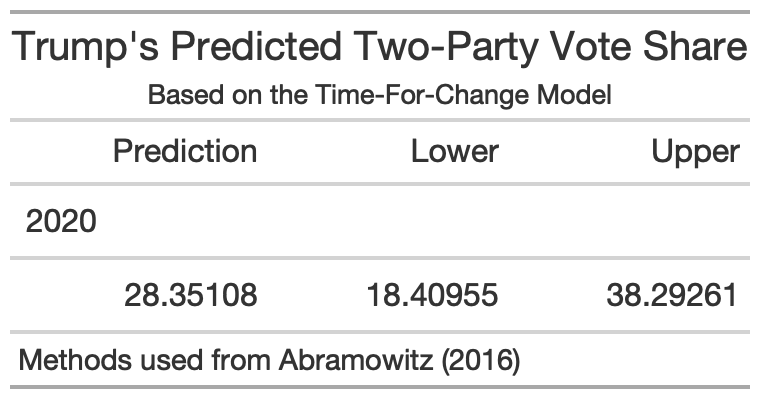

# Incumbency

## October 3, 2020

<br>

### Background

**While there is evidence to suggest that voters don't select an incumbent just because they are an incumbent, there are various theories that suggest the institutional advantages that an incumbent President has can affect voters' preferences.**

In a randomized study by [Adam Brown](https://hollis.harvard.edu/primo-explore/fulldisplay?docid=TN_cdi_proquest_journals_1680832786&context=PC&vid=HVD2&search_scope=everything&tab=everything&lang=en_US), it is shown that at the ballot, having "*incumbent*" next to a candidate's name does not increase their vote share. In this way, voters do not care about incumbency *qua* incumbency (i.e. just the state of being an incumbent does not sway voters). However, this study does not investigate certain advantages from which incumbents benefit.

Some of these advantages include, but are not limited to:
* **Media Attention**: Incumbents have the added benefit of increased media attention throughout their presidency, as compared to challenger's media attention primarily during the election cycle.
* **Fundraising Time**: Incumbents can start fundraising the minute they are elected. Challengers on the other hand, do not typically even decide to run for the presidency until about two years before the election.
* **No Primary**: Incumbents are typically not challenged by a member of their own party. This means that they don't have to spend money against same-party rivals like challengers do, and they can rally the support of their entire party, whereas challengers must compete against rival factions within their party.
* **Economic Manipulation**: There is evidence to suggest that incumbents may manipulate the economy to ensure their victory by moving economic gains to election cycles [(Achen and Bartels)](https://muse-jhu-edu.ezp-prod1.hul.harvard.edu/chapter/2341029). Incumbents may also allocate funds to competitive states during elections years, in order to possibly influence votes in key states [(Kriner and Reeves)](https://hollis.harvard.edu/primo-explore/fulldisplay?docid=TN_cdi_proquest_miscellaneous_1030887189&context=PC&vid=HVD2&search_scope=everything&tab=everything&lang=en_US).

### Time For Change Model

**The Time For Change Model rewards incumbent parties who have higher approval ratings, higher Q2 GDP Growth, and have only served 1 consecutive term.**

Guided by [Pollyvote's](https://pollyvote.com/en/components/models/retrospective/fundamentals-plus-models/time-for-change-model/) recreation of [Abramowitz's](https://hollis.harvard.edu/primo-explore/fulldisplay?docid=TN_cdi_crossref_primary_10_1017_S1049096516001979&context=PC&vid=HVD2&search_scope=everything&tab=everything&lang=en_US) **Time For Change Model**, I used available data from Gallup, The US  Bureau  of Economic Analysis -- Department of Commerce, and former national elections from 1948-2016 in my training set. Abramowitz uses all prior years to an election to train his data, so I decided to do the same. 

The Time For Change Model uses three variables to predict the Incumbent Party Vote Share (%):
* **Net Approval Rating (%)**: Measured by approval rating - disapproval rating from Gallup. Abramowitz used approval rating polls from June/July, so I used the most recent poll from either of those months for each election year in my training set.
* **Q2 GDP Growth (%)**: Measured by the rate of change in GDP from Q1 to Q2.
* **First Term**: Dummy variable to indicate whether or not the incumbent is a first-term president (1) or not (0). Essentially, if a party has been in power for 2 or more consecutive terms, this will be coded as a 0.

Using training data from 1948-2016, the model is summarize below:



Using the coefficient, this gives us the equation:
```
(Predicted Incumbent Party Vote Share) = 47.55 + 0.11 * (Net Approval Rating) + 2.28 * (Q2 GDP Growth) + 4 * (First Term)
```

* For each additional percent in Net Approval Rating, the Incumbent Party Vote Share is predicted to increase by 0.11 percentage points. 
* For each additional percent in Q2 GDP Growth, the Incumbent Party Vote Share is predicted to increase by 2.28 percentage points.
* If the incumbent party has only served one consecutive term, then the Incumbent Party Vote Share is predicted to increase by 4 percentage points.

### 2020 Prediction

**The Time For Change Model is not a good predictor for the 2020 election.**

Using our known variables for 2020:
* Q2 GDP Growth (%) = -9.4947159
* Net Approval Rating (%) = -15
* First Term = 1 

We predict Trump's Two-Party Vote Share:



However, as noted before, the economy in 2020 is a huge outlier, because of the COVID-19 Pandemic. Because this model uses the economy as a predictor, we are extrapolating far outside the training set values, and thus we should be cautious. Because the Q2 GDP Growth is so low, this brings our prediction down significantly. 

Abramowitz himself notes this in his article for [UVA Center for Politics](https://centerforpolitics.org/crystalball/articles/its-the-pandemic-stupid-a-simplified-model-for-forecasting-the-2020-presidential-election/), and refines his own model with different variables. Using Net Approval in late October as his only predictor, Abramowitz now estimates the Electoral Vote instead of the Popular Vote

Sources:

https://centerforpolitics.org/crystalball/articles/its-the-pandemic-stupid-a-simplified-model-for-forecasting-the-2020-presidential-election/


https://www.washingtonpost.com/outlook/2020/08/21/trump-outsider-incumbent-campaign/?arc404=true
