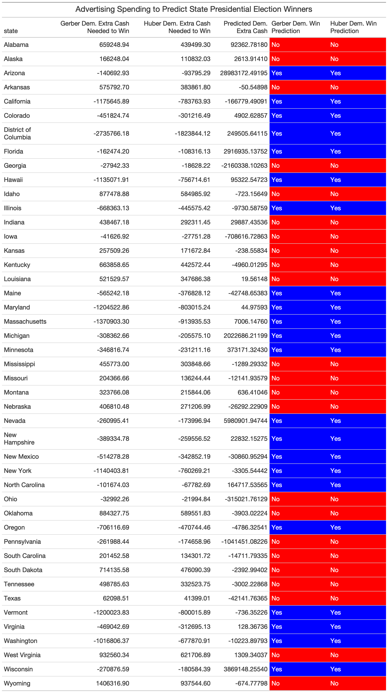

# Advertising

## October 10, 2020

<br>

### Background

**Advertising is a central component of any political campaign. Presidential candidates flood the markets with ads upon ads in order to try to sway voters. But how effective are these advertisements?**

According to [Gerber et. al.](https://www-cambridge-org.ezp-prod1.hul.harvard.edu/core/journals/american-political-science-review/article/how-large-and-longlasting-are-the-persuasive-effects-of-televised-campaign-ads-results-from-a-randomized-field-experiment/DA29FE8A5581C772006A1DEBB21CFC4C), the effect of advertisements diminishes significantly after about a week.

Using [Gerber's](https://www-cambridge-org.ezp-prod1.hul.harvard.edu/core/journals/american-political-science-review/article/how-large-and-longlasting-are-the-persuasive-effects-of-televised-campaign-ads-results-from-a-randomized-field-experiment/DA29FE8A5581C772006A1DEBB21CFC4C) methods, the predicted vote share for a candidate increases by 5 points for every 1000 more **GRPs** (Gross Rating Points: defined as the percent of reachable population who saw an advertisement) they get compared to their opponent.

Using [Huber's](https://hollis.harvard.edu/primo-explore/fulldisplay?docid=TN_cdi_gale_infotracacademiconefile_A170741649&context=PC&vid=HVD2&search_scope=everything&tab=everything&lang=en_US) methods, the predicted vote share increases by 7.5 points for every 1000 more GRPs they get compared to their opponent.

Because these effects diminish after about 1 week, we are going to predict the number of GRPs in the last week before the election.

### Methods

First, I used bootstrap sampling in order to create possible distributions of predicted election win margins for each state based off of the most recent [FiveThirtyEight](https://github.com/fivethirtyeight/data/tree/master/polls) poll averages. Using Gerber and Huber's methods, I calculated the following variables, which describe the predicted number of GRPs a candidate needs to buy more than their opponent in the last week in order to close the Simulated Win Margin to 0:
```
(Gerber Dem. GRPs Needed) = (Simulated Rep. Win Margin) / 5 * 1000
```
```
(Huber Dem. GRPs Needed) = (Simulated Rep. Win Margin) / 7.5 * 1000
```

Because the distributions has such small variances, I opted to simply calculate the means for these variables to use in my predictions for each state, rather than using the confidence intervals, because they were so small.

According to Gerber, each GRP costs approximately \$150  (recalculated to \$175 in 2020). Using this, I was able to calculate how much more the Democrat candidate would have to spend in order to close the Rep. Win Margin to 0:
```
(Gerber Predicted Dem. Extra Cash Needed) = 175 * (Mean Gerber Dem. GRPs Needed)
```

```
(Huber Predicted Dem. Extra Cash Needed) = 175 * (Mean Huber Dem. GRPs Needed)
```

In the case that the predicted values are negative, it means that it is the predicted amount the Democrats could spend *less* than the Republicans and not be losing (Rep. Win Margin = 0).

Then, using advertising data from 2000 to 2016, I was able to calculate the total amount of money spent on advertising in the "early"" period of an election year (April - September), since this is the time frame for which we have advertising data in 2020. This was a simple sum of all campaign advertisings for each candidate in each state over the course of the period. I then calulated the total amount of money spent on advertising in the "late" period of an election year (October - Election Day: ~5 weeks), since this is the remaining time not including the "early" period. This was again a simple sum.

Using these two sums, I calculated the "late/early ratio":
```
(Late/Early Ratio) = (Total Late Spending) / (Total Early Spending)

```
I then found the mean "late/early ratio"" for each party in each state, using a simple mean over the 2000 to 2016 elections.

With this "late/early" ratio, I was able to guess the amount of late period spending for Biden and Trump in 2020 in each state:
```
(Predicted 2020 Late Spending) = (Late/Early Ratio) * (2020 Early Spending)
```

I then had to predict the last week before the election's spending in order to make sure that these data points match the predictions made by the Gerber and Huber calculations. Unfortunately, because of the constraints of the data, I had to simply divide the 2020 Predicted Late Spending by 5 (since this is a sum of ~5 weeks), even though this is likely *not* the case. However, I would bet that Biden and Trump would both increase their spending in this last week, so it is my hope that these spending predictions would at least be proportional to the actual spending results.

To find the Predicted Dem. Extra Cash I thus calculated:
```
(Predicted Dem. Extra Cash) = ((Predicted Biden Late Spending) - (Predicted Trump Late Spending)) / 5
```

This is my prediction of how much more Biden will spend in the last week compared to Trump in each state. If this value is positive, it means Biden is spending more in the final week than Trump, and if this value is negative, it means that Trump is spending more in the final week than Biden in the given state.

Then, all I had to do was simply compare the Predicted Dem. Extra Cash to the Gerber and Huber Predicted Dem. Extra Cash Needed. If the Predicted Dem. Extra Cash were greater than the Predicted Dem. Extra Cash Needed, then Biden was predicted to win the state. If this were less, then Trump was predicted to win the state.

### Results

**Biden is predicted to win key battleground states, giving him a predicted Electoral Victory of 314 - 224.**

The following table summarizes the results:



Both Gerber and Huber's methods give the same results.

A more user-friendly version of the same data is shown by this Predicted Electoral College Map:


As we can see, Biden is predicted to win key states like Florida, Michigan, Wisconsin, Arizona, Virginia, and North Carolina.

Trump, however, is predicted to win Pennsylvania and Ohio.

This gives us the following Electoral College Breakdown:


Biden is predicted to win 314 - 224. 

### Comparison to Other Models

While this model includes polling data and advertising data in order to predict the winner of each state, we should predict this against the Simple Polling Electoral Map made earlier (though this may be slightly inaccurate as the polls were from 2 weeks ago)


We can see that the newer predictions (which includes advertising data), gives both Pennsylvania and Ohio to Trump, whereas the older prediction gave them to Biden. This means that while Biden is polling better in Pennsylvania and Ohio, the newer model predicts that Trump is spending enough money in those states to overtake Biden's lead.

It is interesting to note that these two states are the only states that are predicted differently between the Polls Only Prediction and the Polls + Advertising Prediction.
