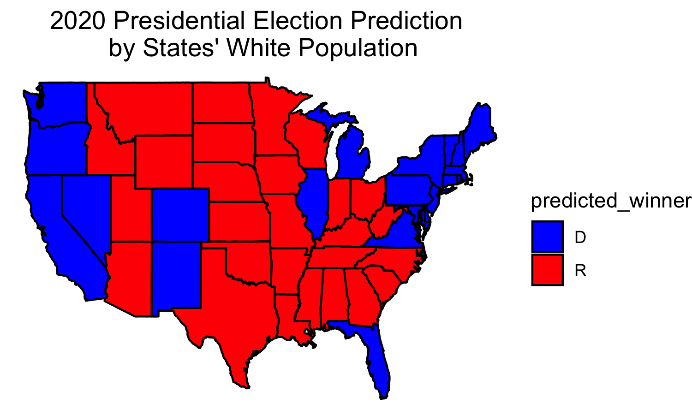

# Demographics

## October 17, 2020

<br>

### Background

**Decreasing proportions of white voters means that the Democrats may be able to win key states.**

Identity politics have become increasingly influential. While some variation does exist, most non-White minority groups tend to vote Democratic. According to [Pew Research](https://www.pewresearch.org/2020/09/23/the-changing-racial-and-ethnic-composition-of-the-u-s-electorate/), because of the decreasing proportion of white voters in many Southern states, the 2020 election will be a year in which non-White voters may be able to turn the vote for the Democrats. 

Specifically, key states like Arizona and Florida are becoming less white, and thus expected to vote more Democratic. On more local levels, [NBC News](https://www.nbcnews.com/meet-the-press/republicans-risk-losing-texas-florida-arizona-state-houses-n1242842) predicts that Republicans may lose the State Houses in Texas, Arizona and Florida.

However, we also note that there is not a perfect relationship between a state's whiteness and a state's Democratic vote share. New England states tend to have higher rates of white people compared to other states, but nonetheless reliably vote Democratic. As a result of this, rather than running a simple linear regression to predict a state's Democratic and Republican votes from just a state's white population percent, I also added a state interaction term so that we could see the different effects within each state itself. 

### Methods

**I had to estimate 2020 demographics in order to predict each state's Democratic and Republican vote shares.**

First, we don't have demographic data for 2020. We do have data from 1990 to 2018. With this data, I used simple linear regression models within each state to predict demographic proportions in 2020. 

Then, using 75% / 25% training/testing sets, I trained a linear model to predict each state's Democratic and Republican votes from the state's white population proportion, coupled with an interaction term for state. (This was so that the proportions are relative for the state, since we don't expect a change in white population proportion to affect Democratic votes the same way across all states). I used a training and testing set so that we could prevent overfitting the data. When testing with the whole data-set, the model predicts a state's winner with 91% accuracy, which is pretty good.

Using this model, we then use the 2020 predicted proportions to predict each state's Democratic and Republican votes.

### Results

**Demographic Model predicts a closer race than polling and other models.**

Using the predicted Democratic and Republican votes, we can then determine the predicted win margins:
```
(Democratic Win Margin) = (Democratic Vote - Republican Vote) / (Democratic Vote + Republican Vote)
```

In the case that the Democratic Win Margin is positive, we know that the model predicts the state to vote Democrat, whereas if the Democratic Win Margin is negative, then we know that the model predicts the state to vote Republican.

The results are shown in the map below:


If we did not care about win margin, and instead only cared about who won the state absolutely, as the Electoral College does, then we get this electoral vote map:



We can see that the changing demographics results in key wins for Biden in states like New Mexico, Florida, Virginia, Pennsylvania, and Michigan. This model predicts that Trump will still win states like Arizona, Wisconsin, the Carolinas, and Georgia.

This summarizes to the following breakdown of the Electoral College:


We can see that this is indeed closer than prior predictions we have created, for an electoral vote prediction:

Biden wins 288 - 250.

### Evaluation

Our model did a pretty good job of predicting the entire dataset, even with leaving out 25%. We saw that it accurately predicted the winner of each state 91% of the time. The in-sample R-Squared value was 0.98, but again, in order to prevent over-fitting the training data, it is better to look at the accuracy score of 91%.

The reason why this model predicts a tighter win for Biden is likely because demographics change at a much slower rate compared to other variables, like polling and the economy. Thus, this model maintains the status quo approach, meaning the predictions are more likely to reflect former elections.

Because this seems like the most conservative approach so far, it makes sense that Biden is predicted to narrowly win. In future posts, I may combine demographics data with polling and possibly advertising in order to better predict the election without overfitting.

