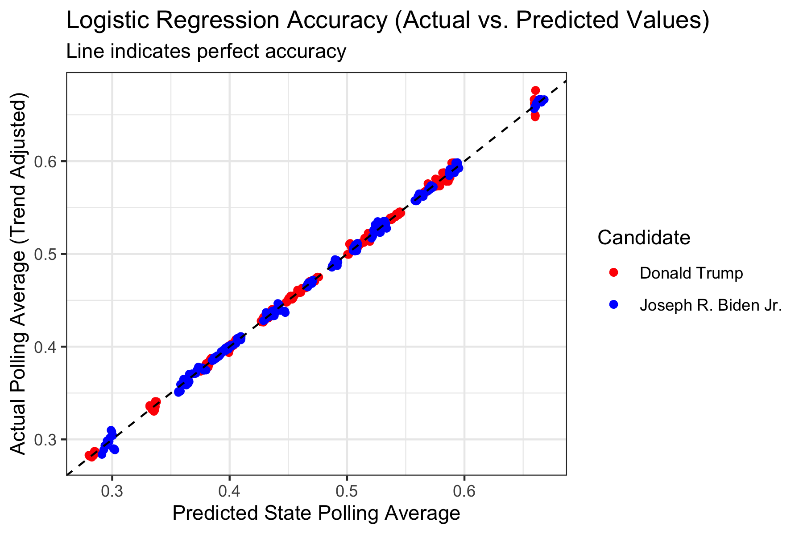
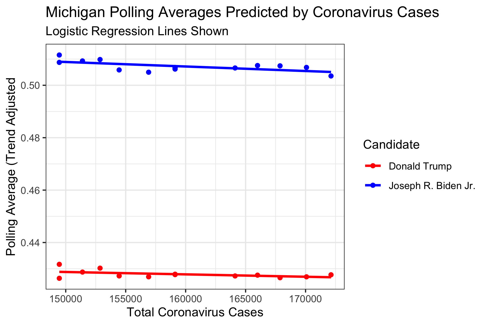

# Shocks: The Coronavirus Pandemic

## October 24, 2020

<br>

### Background

As previously discussed, the Coronavirus Pandemic has affected many different facets which will in some way change the outcome of the 2020 Presidential Election. First and foremost, the pandemic makes in-person voting dangerous. As a result, many states have strengthened and expanded mail-in voting. [The New York Times](https://www.nytimes.com/2020/10/11/us/elections/vote-by-mail-election.html?auth=login-google) predicts that the 2020 election may end up much like the 2000 election, ending with a Supreme Court case as a result of possible lawsuits caused by the rejection of ballots filled out incorrectly.

As we have discussed in previous posts, economic data is a difficult predictor to use in this election because of the drastic effects of the pandemic. [The Wall Street Journal](https://www.wsj.com/articles/its-the-economy-stupid-carries-less-weight-in-2020-election-11599989400) shares this view, saying that the economy does not carry as much weight during this election cycle, due to both increasing polarization, which skews people's perceptions of the economy, and the pandemic.

In this blog, I want to explore how the Coronavirus Pandemic will affect the 2020 Election Results. Because of this, most if not all of this blog will be dedicated to descriptive analysis rather than predictive analysis of the actual election results.

Polling is arguably the predictor which most reflects the opinions of the people, as it comes directly from the people themselves. Because polling reflects people's opinions, I will use Presidential Election polling averages from [FiveThirtyEight](https://data.fivethirtyeight.com) as my response variable, since it seems like a good proxy for public opinion. (An argument could also be made for using Presidential Approval, but because the Presidential Election polling is used most often in predictions). For this reason, I look at how the number of total Coronavirus Cases relates to Polling Averages.

### Theory

***The working theory for this blog is that as Coronavirus Cases increase, less people will vote for Trump, because they will blame him for inadequately responding to the pandemic.***

### Methods

***I created logistic regression models from CDC Coronavirus data and FiveThirtyEight Polling Averages.***

#### Data 

I used Coronavirus state-level data from the [CDC](https://data.cdc.gov/Case-Surveillance/United-States-COVID-19-Cases-and-Deaths-by-State-o/9mfq-cb36) and [FiveThirtyEight](https://data.fivethirtyeight.com) state polling averages. Particularly, I used the number of Total Coronavirus Cases in each state (CDC) and Polling Average (Trend Adjusted), which is an average of polls for a specified time period, adjusted by FiveThirtyEight for changing trends in the data.

#### Logistic Regression 

***We should use a train-test split and make sure to check test accuracy.***

Because our data was split into observations by candidate (i.e. for each poll there were actually two observations, one for Trump and one for Biden), I decided to fit two different regression models.

I did this for two reasons:
* I did not like how the 2 party vote share made it seem like 100% of people voted for either Trump or Biden. I thought it would be interesting to see if there were any trends relating to people refusing to vote for either candidate depending on Coronavirus Cases. (i.e. I wondered if people would be less inclined to vote for either major candidate because they lose faith in the parties to solve the pandemic issue.)
* I did not want to inflate numbers for either candidate. By changing a raw vote share to a two-party vote share, it may make it seem like a candidate has a bigger lead, when they really don't.

Also, because we know that states differ greatly in their political leanings, I thought it was important to create an interaction term for state. This was so that we could see trends within states, rather than across states.

However, because there are not a lot of polling averages for each state, we need to be really careful about overfitting the data. So, we should make sure that we create a train-test split of the data. I chose to do a 75-25 split at random. In addition, because there are so many interaction terms of total_cases and states, it is difficult to write out a logistic regression equation (there are ~40+ variables!). Instead, we can write out the code which produces the model for each candidate: 

```
glm(polling_average ~ total_cases * state, family = "quasibinomial")
```

We use quasibinomial here because our polling averages are not discrete values of 0 and 1 (failure and success), as a normal binomial logit would expect, but instead range from 0 to 1. 

After training the data on the 75% training set, we can then test the data on our 25% testing set. To determine the accuracy of the test, we can calculate the RMSE (Root Mean Squared Error -- which means about how far off each prediction is from the actual value, on average).

```
RMSE = sqrt(mean((actual - predicted)^2))
```

For Trump's model, the training RMSE was 0.001689, or about 0.1689%, and the testing RMSE was 0.002877, or about 0.2877%. For Biden's model, the training RMSE was 0.001798, or about 0.1798%, and the testing RMSE was 0.002877, or about 0.2877%. Even on the testing set, the RMSE is low. 0.2877% is very small, and elections are unlikely to be within that margin of error (though, still possible!). This tells us that our model is pretty accurate for predicting the polling averages.

### Results

***While the model RMSE is extremely low, this is likely due to low variance in the data, rather than predictive power.***

#### Accuracy

We can look at a graph of predicted vs. actual values to also see the results and accuracy of the regression:



However, this does seem suspicious, given that some of the interaction terms indicate that some states actually respond more positively towards Trump the higher that their Total Cases increases, which is contrary to our theory.

The reason why these values may be so close to the line of accuracy is because for each state, there is relatively low variance due to a small number of data points, which means regressions will be able to better predict the points, even if we do a train-test split.

#### Battleground State Investigations

We can investigate some states to see these relationships. Because we are particularly interested in Battleground states, it would be cool to look at Arizona, Michigan, and Ohio in particular.


As we can see, **both** Trump and Biden are predicted to poll **better** when the Total Cases increases. Perhaps both parties are more mobilized the more the pandemic goes on: Republicans may turn out more for Trump in order to prevent further measures from being enacted, and Democrats may turn out more for Biden in hopes of curbing the virus. While this may be true for some time, since we know that the sum of the two polling averages can never exceed 1, this is unrealistic for larger numbers of total cases. In any case, under the realistic domain, it seems that Biden will remain above Trump in polling. However, because of the unrealistic relationship between the two variables, we should be wary of this conclusion. Perhaps instead, we could recalculate each polling average as a 2-party polling average, and then only do one regression (and the other prediction would necessarily be 1 - prediction) in order to get a better relationship between the two variables. 



As we can see, **both** Trump and Biden are predicted to poll **worse** when the Total Cases increases. This may be due to the fact that as the virus rages on, people may be less likely to vote for either candidate, as they may be dissatisfied with the two parties. Again, while this may be true for sometime, since we know that their sum can never exceed 1 (which this would do as Total Cases is near 0), this is unrealistic for small numbers of cases. And again, we should be wary of this result. 


Here we can that as Total Cases increases, Trump's average increases, and Biden's decreases. This is contrary to our theory which would predict the incumbent Trump's average to decrease. However, this does mean that it is more likely for the sum of the two averages to add up to 1, which means this may be a more realistic regression than that for Arizona and Michigan.

While these regressions look like they are linear, that is just because they are super zoomed in pictures of the S-curvy logistic regression.

### Discussion

***We should be worried about (lots of) confounding variables!***

In addition, we should note that total coronavirus cases increases over time (afterall, you cannot remove cases from having occurred; this can only increase), which means that the variable we used as a predictor will have high collinearity with other variables associated with an increase in time. Perhaps the economy in a particular state is getting better, or worse, with time, and that might explain the changes in polling opinion better than coronavirus cases would.

These variables are called confounding variables, and they are essentially hidden variables which might be the *actual* variables that affect our poll averages. Because COVID cases are associated with time so well, there are a multitude of possible confounding variables, especially within each state.

So yes, while our model did predict polling averages well, coronavirus cases may not actually be the variable of interest we are looking for (as evidenced by the very different trends in different states). We can certainly affect the Coronavirus Pandemic to affect the election, but it does not seem like total cases in each state is actually the reason for the change in polling averages.

In future blogs, it may be beneficial to instead consider two-party vote share, since we would not have to worry about making two different regression models, and instead, we would have a single model which could simultaneously be used to predict either Biden or Trump's two-party vote share.
