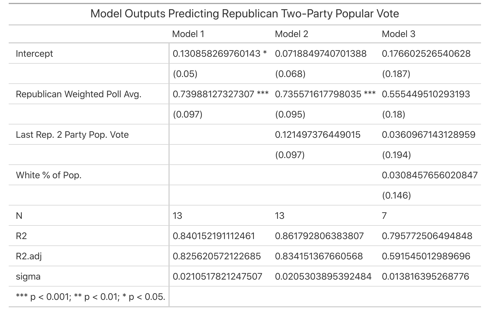
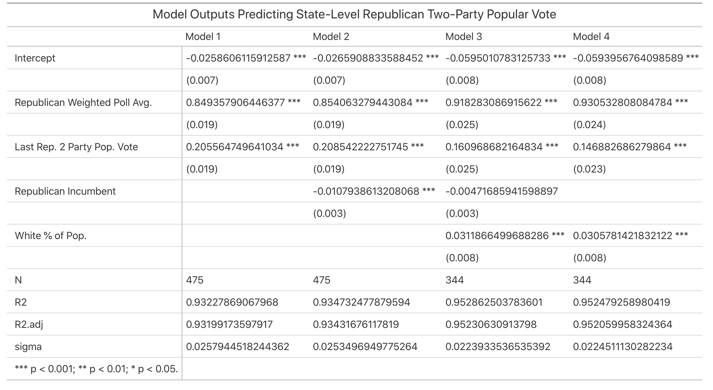
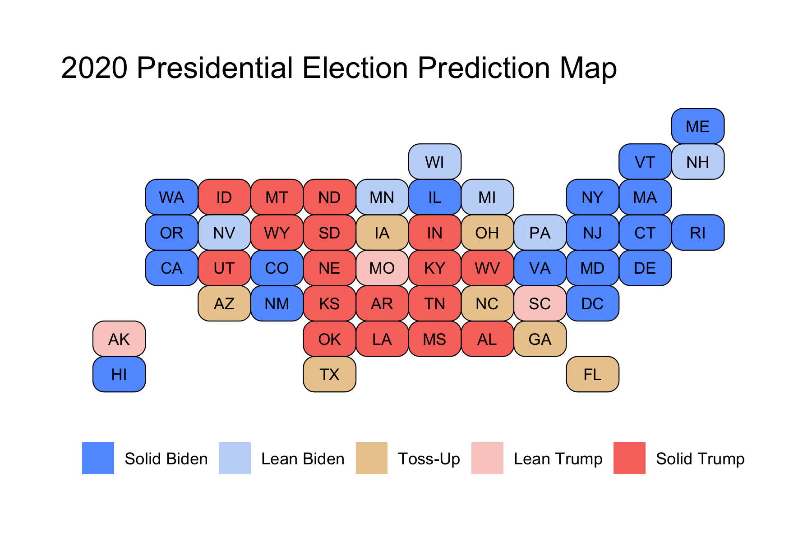
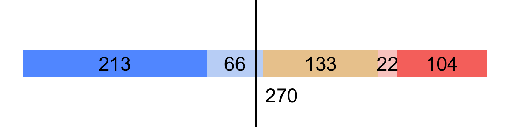

# Final Prediction

## November 1, 2020

<br>

### Background

***This election will be one of the most important in modern history.***

With only 2 more days until the 2020 Presidential Election, both fears and hopes are heightening across America. Will Donald Trump remain in office, or will Joe Biden be able to defeat an incumbent president? In what has been deemed a "Referendum on President Trump" by the [Wall Street Journal](https://www.wsj.com/articles/the-trump-referendum-11604098637) and others, this election has been framed around Trump as a president, rather than the specific policies. Even with hopes of swaying voters by attacking Donald Trump's [COVID-19 response](https://www.cbsnews.com/video/biden-hammers-trump-on-coronavirus-response-in-final-days-of-campaign/), [furthering of racism](https://www.nytimes.com/2020/09/29/us/trump-proud-boys-biden.html), and [denial of the effects of climate change](https://www.npr.org/2020/09/14/912799501/i-don-t-think-science-knows-visiting-fires-trump-denies-climate-change), Biden's main argument is that Donald Trump is simply unfit to be President of the United States. President Trump, on the other hand, has attempted to show voters that he is "Making America Great Again," and he says to vote for Biden would be to elect a corrupt, [life-long politician of 47 years](https://www.businessinsider.com/trump-ive-done-more-in-47-months-than-biden-in-47-years-2020-9). 

***Unprecedented times means bad news for trusted models.***

It would be a mistake to claim that this election is like any other in the history of the United States. We are at the crossroads of [multiple crises](https://www.nytimes.com/2020/06/25/opinion/us-coronavirus-protests.html): COVID-19, a racial reckoning, and the threat of an impending economic depression. While each of these are certain to shape the outcome of the 2020 Presidential Election, the unprecedented events make predictions this election even more difficult than ever before. With record lows seen across the board in economic variables, many fundamentals-based models are [no longer reliable in 2020](https://www.wsj.com/articles/its-the-economy-stupid-carries-less-weight-in-2020-election-11599989400). Polling, too, has been [called into question](https://www.pewresearch.org/fact-tank/2020/10/29/what-we-can-trust-2020-election-polls-to-tell-us/) after the 2016 election, which predicted a near-certain win for Clinton. Even those whose models using the economy have performed well in the past are turning away from such variables in 2020, including Abramowitz, whose Time For Change model predicted a Trump victory in 2016. In 2020, [Abramowitz](https://centerforpolitics.org/crystalball/articles/its-the-pandemic-stupid-a-simplified-model-for-forecasting-the-2020-presidential-election/) instead opted to use net approval, rather than relying on grossly extrapolated predictions using 2nd Quarter GDP Growth, in order to predict the election. 

***Despite the 2016 polls, we can remain (cautiously) confident in 2020 polls.***

Because of the uncertainty associated with extrapolating fundamentals, I have taken Nate Silver's advice: rely on polling close to the election. [Silver](https://fivethirtyeight.com/features/trump-can-still-win-but-the-polls-would-have-to-be-off-by-way-more-than-in-2016/) maintains the belief that polls were not truly *wrong* in 2016, and he says that polls today would have to be even worse than those in 2016 to give Trump a victory. Because of this, I will remain confident in the use of polls in my model.

### National Popular Vote Prediction

***Biden is predicted to win the National Popular Vote.***

First, I wanted to predict the Republican Two-Party Popular Vote Share. I used the following variables in these models:
* *Last Republican Two-Party Popular Vote Share*: the Two-Party Popular Vote Share from the prior election.
* *White Percent of Population*: the estimated White Percent of the National Population (using 2018 data from the Census)
* *Republican Weighted Poll Average*: from 538 daily polling averages. I used any polling averages available up to 2 months before an election.
```
sum(relative weight * daily republican poll average)
```
Where relative weight is calculated as:
```
relative weight = (1 / days left) / sum(1 / days left)
```
and the days left is the number of days from the daily poll average until election day. I decided to 1) only include polls from the last two months because I did not want my average to be skewed by the many polls conducted in the beginning of the election cycle when people were still undecided and 2) weight by the inverse of days until the election because I wanted polls closer to the election to contribute more to the average.

I chose these variables because I believe they do the best job of capturing public opinion about President Trump, which is very much in-line with the "Trump Referendum" speculation. One variable that I considered including was incumbency, but because of the already small sample size, adding another variable made overfitting the data a problem. Incumbency also may not play a huge role in this election, due to President Trump's anti-establishment approach and a not very incumbent-like campaign message.

The first model predicted the Republican Two-Party Popular Vote Share from just the Republican Weighted Poll Average. The second model predicted the Republican Two-Party Popular Vote Share from the Republican Weighted Poll Average and the Last Republican Two-Party Popular Vote Share. The third model predicted the Republican Two-Party Popular Vote Share from the Republican Weighted Poll Average, the Last Republican Two-Party Popular Vote Share, and the White Percent of Population. Because there have been relatively few years in which we have had elections with current data, I relied on Leave One Out Cross Validation (LOOCV) to evaluate a few different linear models.

The results of the models are summarized below:



We can see that the second model has the best in-sample fit, with an R-Squared and R-Squared adjusted higher than the other models. In addition, the second model had an out-of-sample (OOS) Root-Mean-Squared-Error (RMSE) of 0.0246, meaning that on average, data points not included in the training set were about 2.5% off from the model's predicted value, which is not bad. Also, while the third model had a smaller OOS RMSE, we can see that the model's predictors were not seen as statistically significant (as shown in the table above). Because of these reasons, I opted to use the second model for my National Popular Vote Prediction.

Because of the relatively small OOS RMSE (it was only about .5% higher than the in-sample standard error), I retrained the model on the entire data-set, rather than leaving one out. The final National Two-Party Popular Vote Model was:

```
Rep. Two-Party PV = 0.072 + 0.122 * Last Rep. Two-Party PV + 0.736 * Rep. Weighted Poll Avg.
```

These coefficients mean that for every 1% increase in Last Republican Two-Party PV, the model predicts that the Republican Two-Party PV this election will increase by 0.122%, and for every 1% increase in Republican Weighted Poll Average, the model predicts the Republican Two-Party PV this election will increase by 0.736%.

Using the data from 2020:
* *Last Rep. Two-Party PV*: 0.488
* *Rep. Weighted Poll Avg.*: 0.452

Our model's prediction: *Trump receives a Two-Party Vote Share of 0.464, with a 95% Confidence Interval of (0.445 -- 0.482). Biden receives a Two-Party Vote Share of 0.536, with a 95% Confidence Interval of (0.518 -- 0.555).*

This interval is shown below as a distribution of simulated election outcomes from the Republican National PV Model:


We can see that there is almost a 0% chance that President Trump wins the Popular Vote.
However, this does not mean that he will not win the Electoral Vote, as he had done exactly that in the 2016 election. Because of this (very real) possibility, we turn to state-level predictions.

### State Level Predictions

***Joe Biden is predicted to win the Electoral Vote.***

For these linear models, I again used the same three predictors as described above, but because of the increased sample size (as a result of having 50 state elections each time there is a national election), I decided to include incumbency as another variable. I called this variable `R_inc` and it had a value of 0 if there was no Republican Incumbent President that year, and 1 if there was a Republican Incumbent President that year. Note that all of these variables are on the state-level, not the national-level.

Again, I used LOOCV in order to select the best model. The first model predicted the Republican Two-Party Popular Vote Share from the Republican Weighted Poll Average and the Last Republican Two-Party Popular Vote Share. The second model predicted the Republican Two-Party Popular Vote Share from the Republican Weighted Poll Average, the Last Republican Two-Party Popular Vote Share, and Republican Incumbent. The third model predicted the Republican Two-Party Popular Vote Share from the Republican Weighted Poll Average, the Last Republican Two-Party Popular Vote Share, Republican Incumbent, and White Percent of Population. The fourth model predicted the Republican Two-Party Popular Vote Share from the Republican Weighted Poll Average, the Last Republican Two-Party Popular Vote Share, and White Percent of Population.

The results of the models are summarized below:



We can see that the third model has the best in-sample fit, with an R-Squared and R-Squared adjusted higher than the other models. In addition, the third model had an out-of-sample (OOS) Root-Mean-Squared-Error (RMSE) of 0.0226, meaning that on average, data points not included in the training set were about 2.25% off from the model's predicted value, which is again not bad. This was the lowest OOS RMSE of the models. It is also interesting to note that Republican Incumbency was not statistically significant in this model. Nonetheless, I decided to keep it in the model because it was better in both cross-validation and in-sample performance. Because of these reasons, I opted to use the third model for my State Vote Predictions.

I then sampled the data into a 75%-25% train-test split to fit the final model. This gave us the following model:
```
Rep. Two-Party PV = -0.063 + 0.157 * Last Rep. Two-Party PV + 0.929 * Rep. Weighted Poll Avg. - 0.003 * Rep. Incumbent + 0.030 * White Percent of Population
```
for each of the states.

Using this model to predict the 2020 State results, we get the following prediction map:



Where states are categorized as:
* *Solid Trump*: Trump is predicted to win by > 10%
* *Lean Trump*: Trump is predicted to win by > 5%
* *Toss-Up*: Trump is predicted to win or lose by < 5%
* *Lean Biden*: Biden is predicted to win by > 5%
* *Solid Biden*: Biden is predicted to win by > 10%

We can see that many states that voted for Trump in 2016 now are categorized as Lean Biden, like Wisconsin, Michigan, and Pennsylvania. Now Toss-Up states are those that usually lean Republican, like Georgia, Texas, and Arizona.

This gives us the following Electoral College Break-Down:



As we can see, Biden will win if he does indeed win all of the Solid Biden and Lean Biden states.

Our model's prediction: *Trump receives 188 Electoral Votes, with a 95% Confidence Interval of (150 -- 204), and Biden receives 350 Electoral Votes, with a 95% Confidence Interval of (334 -- 388).*

However, I felt it was important to introduce slightly more uncertainty into the model, especially given the COVID-19 Pandemic, potentially record Voter Turnout, and the possibility of contested elections. As such, I manually constructed a 95% Confidence Interval using Margin of Error = 2 * OOS RMSE = 4.5%, giving us larger intervals. This resulted in the following prediction: *Trump receives 188 (114 -- 325) Electoral Votes and Biden receives 350 (213 -- 424) Electoral Votes. (95% Confidence Intervals shown in parentheses). 

In both cases, Biden is still predicted to win, but with a larger uncertainty introduced, it is *possible* for him to either slightly lose or to win in a major landslide victory.


