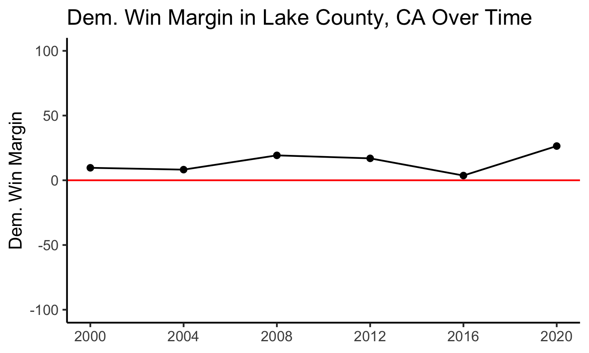

# Differences in 2020

## November 22, 2020

 

### How does the 2020 Presidential Election stand out from historical trends?

The 2020 Presidential Election was certainly like no other before; with unprecedented voter turnout, record breaking popular vote totals, and the effects of the Coronavirus Pandemic front and center, how could this election possibly be like previous ones? Nonetheless, this election largely followed the same trends as previous years. Even with states in the Midwest and Georgia flipping Blue compared to 2016, we can hardly say these were shocking surprises. We knew that Democrat support in key cities and suburbs was growing, while Republican strongholds in rural areas continued to dominate.

But when we look at the county-level data, we do see some surprises. In the plot below, we can see the 2020 Democrat Win Margins vs. 2016 Democrat Win Margins on the county-level. Here we can see that most points lie above the red line, indicating an overall shift in favor of the Democrats compared to the year prior. However, we can also see some important outliers, outlined in Red and Orange.

Note that the other outlier near Lake County, California is supposedly Jackson County, Missouri, but I suspect this is due to misreported data, as the county has been steadily Democrat and voted for Clinton in 2016.

While not all of Texas' counties are outlined, I outlined the ones that seemed to divert from trends the most. It is interesting to note that many of these points far below the line come from Texas.

Two counties of note are also Lake County, California, and Miami-Dade County, Florida.

#### Miami-Dade County, Florida

Perhaps the most popularized by the media was Miami-Dade County in Florida. In the past, this county has been increasingly Democratic, and Hillary Clinton handily won the county by 29 points. However, this was not the case in 2020. Biden was able to narrowly beat Trump by 7 points, a 22 point swing towards Trump since 2016. 

We can see the increasingly Democratic trend, and the sharp drop towards Trump in 2020 below:

Many speculations attribute this to the Trump campaign's rhetoric on the Democratic Party's move towards socialism in America, a move which helped to sway many Cuban-Americans who had fled Communist Cuba towards the Republican Party. 

#### Lake County, California

Less noted in the media, Lake County California shifted heavily Democratic. Since Obama's election, the county has been becoming more Republican (though they still voted Democrat). However, in 2020 there was a stark contrast to its past elections, and instead turned heavily in favor of Biden. 

This area was heavily affected by the California wildfires, and some believe that this is why the area turned in favor of the Democrats this year.

#### What's Up With Texas?

Despite Texas' increasingly Democratic tendencies in recent elections (such as Beto's race against Cruz), a lot of the state's counties turned away from Democrats this Presidential Election, instead turning more red.

These counties are also those that are very close to the border. Many of them have voted for Democratic Presidents, but this year, there has been a sharp decline in Democratic support across the board in these border and near-border counties. While many counties stayed Blue, Zapata county did flip to Red.

[The Texas Tribune](https://www.texastribune.org/2020/11/13/south-texas-donald-trump/) notes that these counties did not vote for Republicans down-ballot, but instead opted for Trump over Biden. They [also say](https://www.texastribune.org/2020/11/13/south-texas-voters-donald-trump/) that despite being Hispanic, many voters here voted for Trump because they share similar values to other supporters -- they are religious, socially conservative, and work in industries like oil and gas. They believe Biden's plan to transition away from fossil fuels threatened their livelihoods.

